# Audiophile Linux v4.0 インストールメモ
## 参考文献

- [AP Linux v4 install instructions | AudioPhile Linux](https://www.ap-linux.com/documentation/ap-linux-v4-install-instructions/)

### 注意: pacman -Suy 実行時に libxfont の依存関係でエラーが出力される場合がある。

```
<apl>[~]# pacman -Suy
:: Synchronizing package databases...
 core is up to date
 extra is up to date
 community is up to date
:: Starting full system upgrade...
:: Replace compositeproto with extra/xorgproto? [Y/n]
:: Replace damageproto with extra/xorgproto? [Y/n]
:: Replace dmxproto with extra/xorgproto? [Y/n]
:: Replace fixesproto with extra/xorgproto? [Y/n]
:: Replace fontsproto with extra/xorgproto? [Y/n]
:: Replace gnome-themes-standard with extra/gnome-themes-extra? [Y/n]
:: Replace inputproto with extra/xorgproto? [Y/n]
:: Replace kbproto with extra/xorgproto? [Y/n]
:: Replace randrproto with extra/xorgproto? [Y/n]
:: Replace recordproto with extra/xorgproto? [Y/n]
:: Replace renderproto with extra/xorgproto? [Y/n]
:: Replace rfkill with core/util-linux? [Y/n]
:: Replace scrnsaverproto with extra/xorgproto? [Y/n]
:: Replace videoproto with extra/xorgproto? [Y/n]
:: Replace xextproto with extra/xorgproto? [Y/n]
:: Replace xf86dgaproto with extra/xorgproto? [Y/n]
:: Replace xf86vidmodeproto with extra/xorgproto? [Y/n]
:: Replace xineramaproto with extra/xorgproto? [Y/n]
:: Replace xproto with extra/xorgproto? [Y/n]
resolving dependencies...
looking for conflicting packages...
error: failed to prepare transaction (could not satisfy dependencies)
:: libxfont: removing fontsproto breaks dependency 'fontsproto>=2.1.3'
<apl>[~]#
```

## 手順

### VirtualBox で起動した直後から

1. 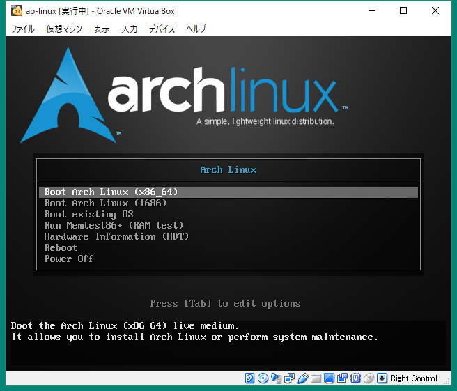
1. 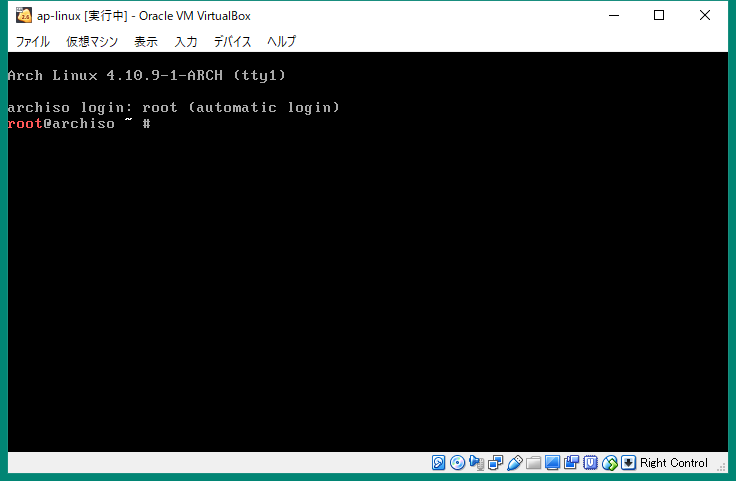
1. 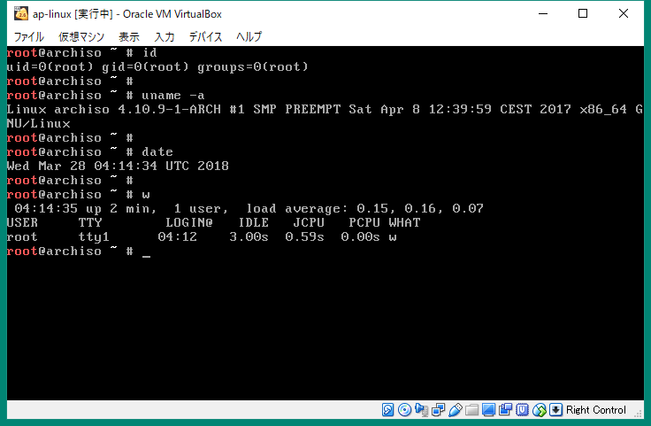
1. 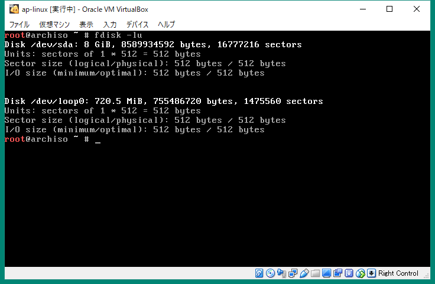
1. 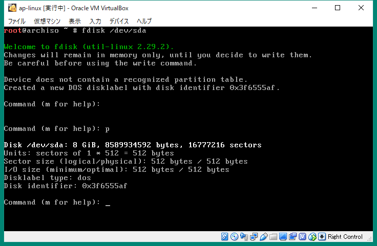
1. 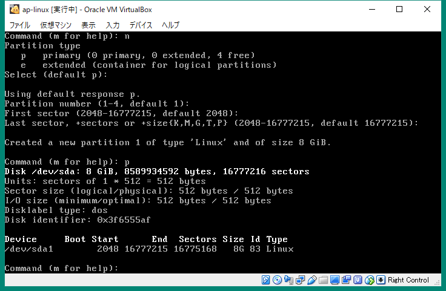
1. 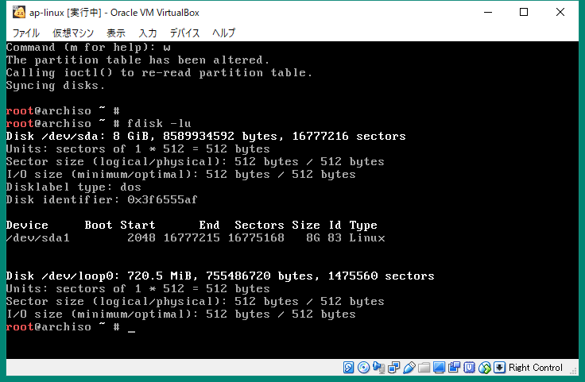
1. 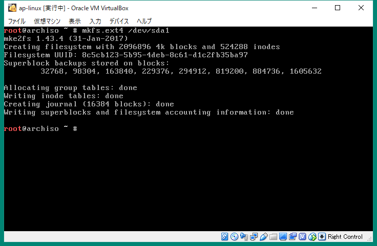
1. 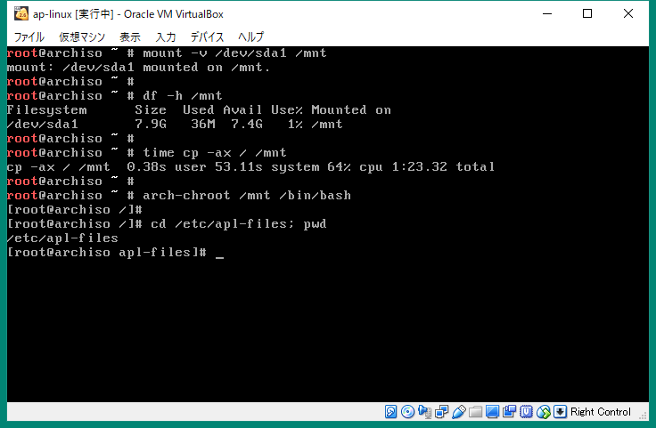
1. 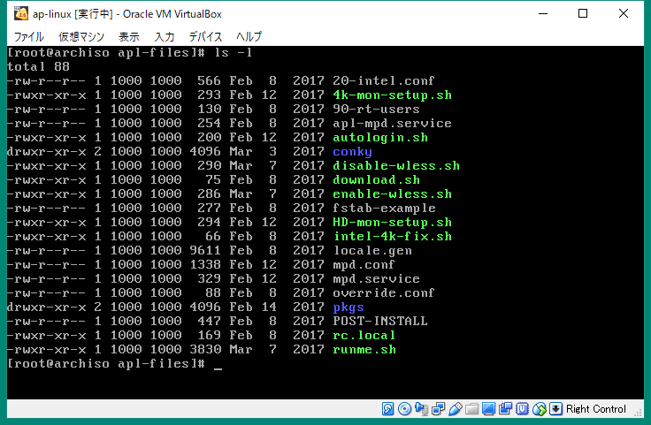
1. 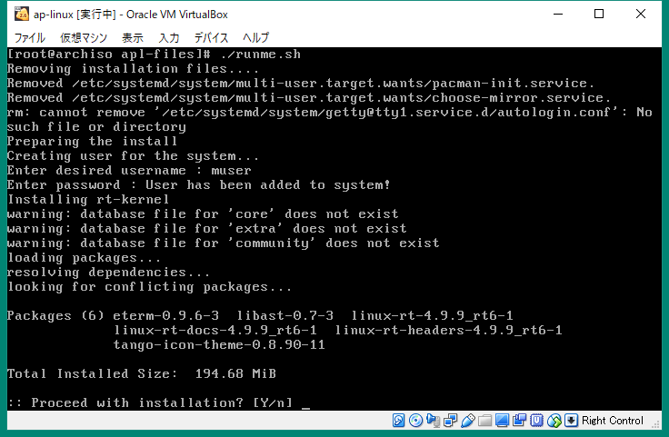
1. 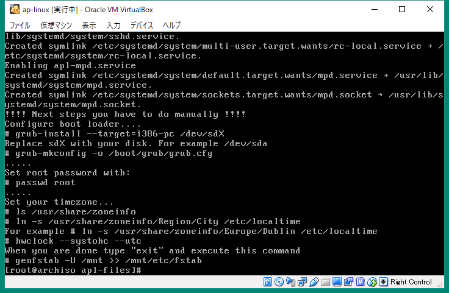
1. 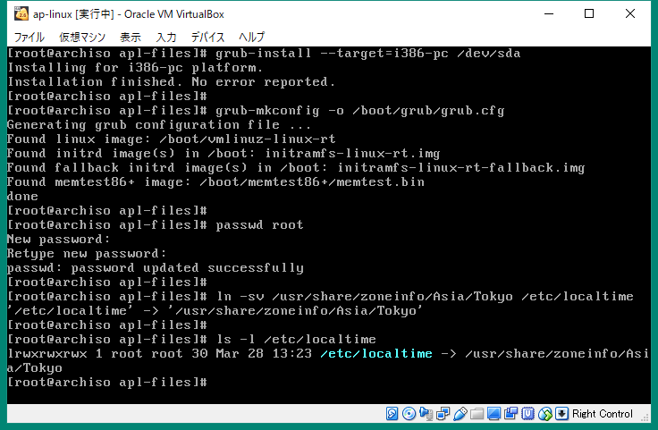
1. 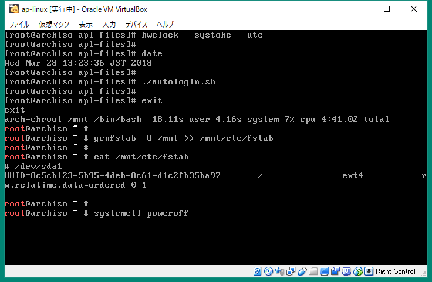

### ログイン情報確認

```
<apl>[~]$ id
uid=1000(muser) gid=1000(muser) groups=1000(muser),10(wheel),92(audio),100(users)
<apl>[~]$ uname -a
Linux apl 4.9.9-rt6-1-rt #1 SMP PREEMPT RT Tue Feb 14 21:12:36 GMT 2017 x86_64 GNU/Linux
<apl>[~]$ date
Wed Mar 28 14:13:55 JST 2018
<apl>[~]$ w
 14:13:55 up 1 min,  2 users,  load average: 0.32, 0.12, 0.04
USER     TTY        LOGIN@   IDLE   JCPU   PCPU WHAT
muser    tty1      14:12   56.00s  1.54s  0.00s xinit /home/muser/.xinitrc -- /
muser    pts/0     14:13    2.00s  0.23s  0.00s w
<apl>[~]$ df -h
Filesystem      Size  Used Avail Use% Mounted on
/dev/sda1       7.9G  2.6G  4.9G  34% /
<apl>[~]$
```

### IP アドレス確認

```
<apl>[~]$ ip addr show
1: lo: <LOOPBACK,UP,LOWER_UP> mtu 65536 qdisc noqueue state UNKNOWN group default qlen 1
    link/loopback 00:00:00:00:00:00 brd 00:00:00:00:00:00
    inet 127.0.0.1/8 scope host lo
       valid_lft forever preferred_lft forever
    inet6 ::1/128 scope host
       valid_lft forever preferred_lft forever
2: eth0: <BROADCAST,MULTICAST,UP,LOWER_UP> mtu 1500 qdisc fq_codel state UP group default qlen 1000
    link/ether 08:00:27:12:e3:0f brd ff:ff:ff:ff:ff:ff
    inet 10.0.2.15/24 brd 10.0.2.255 scope global eth0
       valid_lft forever preferred_lft forever
    inet6 fe80::731:3e6a:7ed1:4c7e/64 scope link
       valid_lft forever preferred_lft forever
3: eth1: <BROADCAST,MULTICAST,UP,LOWER_UP> mtu 1500 qdisc fq_codel state UP group default qlen 1000
    link/ether 08:00:27:18:9d:ba brd ff:ff:ff:ff:ff:ff
    inet 192.168.56.130/24 brd 192.168.56.255 scope global eth1
       valid_lft forever preferred_lft forever
    inet6 fe80::8770:170:c877:d7a4/64 scope link
       valid_lft forever preferred_lft forever
<apl>[~]$
```

### 国内ミラー: レスポンスタイム確認

```
<apl>[~]$ ping -c 4 ftp.tsukuba.wide.ad.jp
PING ftp.tsukuba.wide.ad.jp (203.178.132.80) 56(84) bytes of data.
64 bytes from ftp.tsukuba.wide.ad.jp (203.178.132.80): icmp_seq=1 ttl=52 time=45.3 ms
64 bytes from ftp.tsukuba.wide.ad.jp (203.178.132.80): icmp_seq=2 ttl=52 time=30.1 ms
64 bytes from ftp.tsukuba.wide.ad.jp (203.178.132.80): icmp_seq=3 ttl=52 time=31.9 ms
64 bytes from ftp.tsukuba.wide.ad.jp (203.178.132.80): icmp_seq=4 ttl=52 time=14.4 ms

--- ftp.tsukuba.wide.ad.jp ping statistics ---
4 packets transmitted, 4 received, 0% packet loss, time 3005ms
rtt min/avg/max/mdev = 14.409/30.471/45.368/10.982 ms
<apl>[~]$

```

```
<apl>[~]$ ping -c 4 ftp.jaist.ac.jp
PING ftp.jaist.ac.jp (150.65.7.130) 56(84) bytes of data.
64 bytes from ftp.jaist.ac.jp (150.65.7.130): icmp_seq=1 ttl=240 time=18.5 ms
64 bytes from ftp.jaist.ac.jp (150.65.7.130): icmp_seq=2 ttl=240 time=17.3 ms
64 bytes from ftp.jaist.ac.jp (150.65.7.130): icmp_seq=3 ttl=240 time=17.4 ms
64 bytes from ftp.jaist.ac.jp (150.65.7.130): icmp_seq=4 ttl=240 time=27.7 ms

--- ftp.jaist.ac.jp ping statistics ---
4 packets transmitted, 4 received, 0% packet loss, time 3006ms
rtt min/avg/max/mdev = 17.337/20.271/27.711/4.321 ms
<apl>[~]$
```

### ミラーリスト編集

```
<apl>[~]$ cd /etc/pacman.d; pwd
/etc/pacman.d
<apl>[pacman.d]$ ls -l
total 24
drwxr-xr-x 2 root root  4096 Mar 28 14:06 gnupg
-rw-r--r-- 1 root root 18384 Apr 16  2017 mirrorlist
<apl>[pacman.d]$ sudo cp -aiv mirrorlist mirrorlist.`date +%Y%m%d`
'mirrorlist' -> 'mirrorlist.20180328'
<apl>[pacman.d]$ ls -l mirrorlist mirrorlist.`date +%Y%m%d`
-rw-r--r-- 1 root root 18384 Apr 16  2017 mirrorlist
-rw-r--r-- 1 root root 18384 Apr 16  2017 mirrorlist.20180328
<apl>[pacman.d]$
```

```
<apl>[pacman.d]$ sudo vi mirrorlist
<apl>[pacman.d]$ cat mirrorlist
## Japan
Server = http://ftp.tsukuba.wide.ad.jp/Linux/archlinux/$repo/os/$arch
Server = http://ftp.jaist.ac.jp/pub/Linux/ArchLinux/$repo/os/$arch
<apl>[pacman.d]$ cd; pwd
/home/muser
<apl>[~]$
```

### OS アップデート

```
<apl>[~]$ sudo pacman-key --init
gpg: /etc/pacman.d/gnupg/trustdb.gpg: trustdb created
gpg: no ultimately trusted keys found
gpg: starting migration from earlier GnuPG versions
gpg: porting secret keys from '/etc/pacman.d/gnupg/secring.gpg' to gpg-agent
gpg: migration succeeded
gpg: Generating pacman keyring master key...
gpg: key 805F6B98F9135EF7 marked as ultimately trusted
gpg: directory '/etc/pacman.d/gnupg/openpgp-revocs.d' created
gpg: revocation certificate stored as '/etc/pacman.d/gnupg/openpgp-revocs.d/5927B4EABFAD7A3FD0F69625805F6B98F9135EF7.rev'
gpg: Done
==> Updating trust database...
gpg: marginals needed: 3  completes needed: 1  trust model: pgp
gpg: depth: 0  valid:   1  signed:   0  trust: 0-, 0q, 0n, 0m, 0f, 1u
<apl>[~]$
```

```
<apl>[~]$ sudo pacman-key --populate archlinux
==> Appending keys from archlinux.gpg...
==> Locally signing trusted keys in keyring...
  -> Locally signing key 684148BB25B49E986A4944C55184252D824B18E8...
  -> Locally signing key 91FFE0700E80619CEB73235CA88E23E377514E00...
  -> Locally signing key AB19265E5D7D20687D303246BA1DFB64FFF979E7...
  -> Locally signing key 0E8B644079F599DFC1DDC3973348882F6AC6A4C2...
  -> Locally signing key 44D4A033AC140143927397D47EFD567D4C7EA887...
==> Importing owner trust values...
gpg: setting ownertrust to 4
gpg: setting ownertrust to 4
gpg: inserting ownertrust of 4
gpg: setting ownertrust to 4
gpg: setting ownertrust to 4
==> Disabling revoked keys in keyring...
  -> Disabling key 7FA647CD89891DEDC060287BB9113D1ED21E1A55...
  -> Disabling key D4DE5ABDE2A7287644EAC7E36D1A9E70E19DAA50...
  -> Disabling key 40440DC037C05620984379A6761FAD69BA06C6A9...
  -> Disabling key BC1FBE4D2826A0B51E47ED62E2539214C6C11350...
  -> Disabling key 63F395DE2D6398BBE458F281F2DBB4931985A992...
  -> Disabling key 8F76BEEA0289F9E1D3E229C05F946DED983D4366...
  -> Disabling key 81D7F8241DB38BC759C80FCE3A726C6170E80477...
  -> Disabling key 5E7585ADFF106BFFBBA319DC654B877A0864983E...
  -> Disabling key E7210A59715F6940CF9A4E36A001876699AD6E84...
  -> Disabling key F5A361A3A13554B85E57DDDAAF7EF7873CFD4BB6...
  -> Disabling key 9515D8A8EAB88E49BB65EDBCE6B456CAF15447D5...
  -> Disabling key 4A8B17E20B88ACA61860009B5CED81B7C2E5C0D2...
  -> Disabling key 0B20CA1931F5DA3A70D0F8D2EA6836E1AB441196...
  -> Disabling key 66BD74A036D522F51DD70A3C7F2A16726521E06D...
  -> Disabling key 27FFC4769E19F096D41D9265A04F9397CDFD6BB0...
==> Updating trust database...
gpg: marginals needed: 3  completes needed: 1  trust model: pgp
gpg: depth: 0  valid:   1  signed:   5  trust: 0-, 0q, 0n, 0m, 0f, 1u
gpg: depth: 1  valid:   5  signed:  70  trust: 0-, 0q, 0n, 5m, 0f, 0u
gpg: depth: 2  valid:  68  signed:  10  trust: 68-, 0q, 0n, 0m, 0f, 0u
gpg: next trustdb check due at 2018-06-25
<apl>[~]$
```

```
<apl>[~]$ sudo pacman -Sy
:: Synchronizing package databases...
 core                     130.2 KiB  4.24M/s 00:00 [######################] 100%
 extra                   1604.1 KiB  1343K/s 00:01 [######################] 100%
 community                  4.2 MiB  11.0M/s 00:00 [######################] 100%
<apl>[~]$
```

```
<apl>[~]$ sudo pacman -S archlinux-keyring
resolving dependencies...
looking for conflicting packages...

Packages (1) archlinux-keyring-20180322-1

Total Download Size:   0.65 MiB
Total Installed Size:  0.91 MiB
Net Upgrade Size:      0.06 MiB

:: Proceed with installation? [Y/n]
:: Retrieving packages...
 archlinux-keyring-2...   662.0 KiB  4.72M/s 00:00 [######################] 100%
(1/1) checking keys in keyring                     [######################] 100%
(1/1) checking package integrity                   [######################] 100%
(1/1) loading package files                        [######################] 100%
(1/1) checking for file conflicts                  [######################] 100%
(1/1) checking available disk space                [######################] 100%
:: Processing package changes...
(1/1) upgrading archlinux-keyring                  [######################] 100%
==> Appending keys from archlinux.gpg...
==> Locally signing trusted keys in keyring...
  -> Locally signing key DDB867B92AA789C165EEFA799B729B06A680C281...
  -> Locally signing key 684148BB25B49E986A4944C55184252D824B18E8...
  -> Locally signing key 91FFE0700E80619CEB73235CA88E23E377514E00...
  -> Locally signing key AB19265E5D7D20687D303246BA1DFB64FFF979E7...
  -> Locally signing key 0E8B644079F599DFC1DDC3973348882F6AC6A4C2...
==> Importing owner trust values...
gpg: setting ownertrust to 4
==> Disabling revoked keys in keyring...
  -> Disabling key 7FA647CD89891DEDC060287BB9113D1ED21E1A55...
  -> Disabling key D4DE5ABDE2A7287644EAC7E36D1A9E70E19DAA50...
  -> Disabling key 40440DC037C05620984379A6761FAD69BA06C6A9...
  -> Disabling key B1F2C889CB2CCB2ADA36D963097D629E437520BD...
  -> Disabling key BC1FBE4D2826A0B51E47ED62E2539214C6C11350...
  -> Disabling key 63F395DE2D6398BBE458F281F2DBB4931985A992...
  -> Disabling key 8F76BEEA0289F9E1D3E229C05F946DED983D4366...
  -> Disabling key 4FCF887689C41B09506BE8D5F3E1D5C5D30DB0AD...
  -> Disabling key 81D7F8241DB38BC759C80FCE3A726C6170E80477...
  -> Disabling key 5E7585ADFF106BFFBBA319DC654B877A0864983E...
  -> Disabling key E7210A59715F6940CF9A4E36A001876699AD6E84...
  -> Disabling key F5A361A3A13554B85E57DDDAAF7EF7873CFD4BB6...
  -> Disabling key 8CF934E339CAD8ABF342E822E711306E3C4F88BC...
  -> Disabling key 5696C003B0854206450C8E5BE613C09CB4440678...
  -> Disabling key 9515D8A8EAB88E49BB65EDBCE6B456CAF15447D5...
  -> Disabling key 4A8B17E20B88ACA61860009B5CED81B7C2E5C0D2...
  -> Disabling key 0B20CA1931F5DA3A70D0F8D2EA6836E1AB441196...
  -> Disabling key 34C5D94FE7E7913E86DC427E7FB1A3800C84C0A5...
  -> Disabling key 39F880E50E49A4D11341E8F939E4F17F295AFBF4...
  -> Disabling key 66BD74A036D522F51DD70A3C7F2A16726521E06D...
  -> Disabling key 07DFD3A0BC213FA12EDC217559B3122E2FA915EC...
  -> Disabling key 44D4A033AC140143927397D47EFD567D4C7EA887...
  -> Disabling key 27FFC4769E19F096D41D9265A04F9397CDFD6BB0...
  -> Disabling key 8840BD07FC24CB7CE394A07CCF7037A4F27FB7DA...
==> Updating trust database...
gpg: marginals needed: 3  completes needed: 1  trust model: pgp
gpg: depth: 0  valid:   1  signed:   5  trust: 0-, 0q, 0n, 0m, 0f, 1u
gpg: depth: 1  valid:   5  signed:  82  trust: 0-, 0q, 0n, 5m, 0f, 0u
gpg: depth: 2  valid:  78  signed:  11  trust: 78-, 0q, 0n, 0m, 0f, 0u
gpg: next trustdb check due at 2018-06-25
:: Running post-transaction hooks...
(1/1) Arming ConditionNeedsUpdate...
<apl>[~]$
```

- 依存関係エラー回避のため, `libxfont` を削除する。

```
<apl>[~]$ sudo pacman -Rdd libxfont

Packages (1) libxfont-1.5.2-1

Total Removed Size:  0.30 MiB

:: Do you want to remove these packages? [Y/n]
:: Processing package changes...
(1/1) removing libxfont                            [######################] 100%
:: Running post-transaction hooks...
(1/1) Arming ConditionNeedsUpdate...
<apl>[~]$
```

```
<apl>[~]$ time sudo pacman -Suy
:: Synchronizing package databases...
 core is up to date
 extra is up to date
 community is up to date
:: Starting full system upgrade...
:: Replace compositeproto with extra/xorgproto? [Y/n]
:: Replace damageproto with extra/xorgproto? [Y/n]
:: Replace dmxproto with extra/xorgproto? [Y/n]
:: Replace fixesproto with extra/xorgproto? [Y/n]
:: Replace fontsproto with extra/xorgproto? [Y/n]
:: Replace gnome-themes-standard with extra/gnome-themes-extra? [Y/n]
:: Replace inputproto with extra/xorgproto? [Y/n]
:: Replace kbproto with extra/xorgproto? [Y/n]
:: Replace randrproto with extra/xorgproto? [Y/n]
:: Replace recordproto with extra/xorgproto? [Y/n]
:: Replace renderproto with extra/xorgproto? [Y/n]
:: Replace rfkill with core/util-linux? [Y/n]
:: Replace scrnsaverproto with extra/xorgproto? [Y/n]
:: Replace videoproto with extra/xorgproto? [Y/n]
:: Replace xextproto with extra/xorgproto? [Y/n]
:: Replace xf86dgaproto with extra/xorgproto? [Y/n]
:: Replace xf86vidmodeproto with extra/xorgproto? [Y/n]
:: Replace xineramaproto with extra/xorgproto? [Y/n]
:: Replace xproto with extra/xorgproto? [Y/n]
resolving dependencies...
looking for conflicting packages...
warning: dependency cycle detected:
warning: harfbuzz will be installed before its freetype2 dependency
warning: dependency cycle detected:
warning: mesa will be installed before its libglvnd dependency
warning: dependency cycle detected:
warning: usbmuxd will be installed before its libimobiledevice dependency

Packages (437) acl-2.2.52-4  adwaita-icon-theme-3.28.0-1  alsa-lib-1.1.5-1
               alsa-utils-1.1.5-2  arch-install-scripts-18-1  argon2-20171227-3
               at-spi2-atk-2.26.2-1  at-spi2-core-2.28.0-1  atk-2.28.1-1
               attr-2.4.47-3  audiofile-0.3.6-4  avahi-0.7-4  bash-4.4.019-1
               bind-tools-9.12.1-1  bluez-libs-5.49-1  btrfs-progs-4.15.1-1
               bubblewrap-0.2.0-1  bzip2-1.0.6-7
               ca-certificates-mozilla-3.36-1  cairo-1.15.10+54+g1ed124ace-1
               cantarell-fonts-1:0.101-1  cantata-2.2.0-3  colord-1.4.2-1
               compositeproto-0.4.2-3 [removal]  confuse-3.2.1-1
               conky-1.10.8-2  coreutils-8.29-1  cryptsetup-2.0.2-1
               curl-7.59.0-2  damageproto-1.2.1-3 [removal]  dbus-1.12.6-1
               dbus-glib-0.110-1  dconf-0.28.0-1  ddrescue-1.23-1
               device-mapper-2.02.177-5  dhclient-4.4.1-4  dhcpcd-7.0.1-1
               dialog-1:1.3_20171209-1  diffutils-3.6-1  ding-libs-0.6.1-1
               dmxproto-2.3.1-3 [removal]  dnsmasq-2.79-1
               dnssec-anchors-20170711-1  double-conversion-3.0.0-1
               e2fsprogs-1.44.0-1  efitools-1.7.0.5.g0649468-1  efivar-34-1
               elinks-0.13-19  emacs-nox-25.3-1  ethtool-1:4.15-1
               exempi-2.4.5-1  exfat-utils-1.2.8-1  exiv2-0.26-2  expat-2.2.5-1
               f2fs-tools-1.10.0-1  faac-1.29.9.2-1  faad2-2.8.8-1
               ffmpeg-1:3.4.2-2  ffmpeg2.8-2.8.14-1  fftw-3.3.7-1  file-5.32-1
               filesystem-2018.1-2  fixesproto-5.0+9+g4292ec1-1 [removal]
               fluxbox-1.3.7-3  fontconfig-2.13.0+10+g58f5285-1
               fontsproto-2.1.3-1 [removal]  freetype2-2.9-2
               fribidi-1.0.1+8+gdf7252b-1  fsarchiver-0.8.4-1
               fuse-common-3.2.1-1  fuse2-2.9.7-4  gawk-4.2.1-1  gc-7.6.4-1
               gcc-libs-7.3.1+20180312-2  gcr-3.28.0-1  gdbm-1.14.1-1
               gdk-pixbuf2-2.36.11+70+g00e03a272-1  geoip-1.6.11-1
               geoip-database-20180306-1  glib-networking-2.56.0-1
               glib2-2.56.0+7+g66948ae23-1  glibc-2.26-11  gnome-autoar-0.2.3-1
               gnome-desktop-1:3.28.0-1  gnome-keyring-1:3.28.0.2-1
               gnome-themes-extra-3.28-1
               gnome-themes-standard-3.22.2-1 [removal]  gnupg-2.2.5-1
               gnutls-3.5.18-1  gobject-introspection-runtime-1.56.0-1
               gpgme-1.10.0-2  gpm-1.20.7-8  gptfdisk-1.0.3-1
               graphite-1:1.3.11-1  grep-3.1-1  grml-zsh-config-0.14.3-1
               grub-2:2.02-5  gsettings-desktop-schemas-3.28.0+1+g85521dc-1
               gsm-1.0.17-1  gssproxy-0.8.0-1
               gtk-update-icon-cache-3.22.29+4+gb485cf91b5-1
               gtk3-3.22.29+4+gb485cf91b5-1  gvfs-1.36.0-2  gzip-1.9-1
               harfbuzz-1.7.6-1  haveged-1.9.1-4  hdf5-1.10.1-2  hdparm-9.54-1
               hicolor-icon-theme-0.17-1  htop-2.1.0-2  hwids-20171003-1
               iana-etc-20180221-1  icu-60.2-1  imlib2-1.4.10-1
               inputproto-2.3.2-1 [removal]  intel-ucode-20180312-1
               iproute2-4.15.0-1  iptables-1.6.2-2  iputils-20161105.1f2bb12-2
               ipw2100-fw-1.3-8  ipw2200-fw-3.1-6  iso-codes-3.76-1  iw-4.14-1
               jansson-2.10-3  jasper-2.0.14-1  js185-1.0.0-4  json-c-0.13-1
               json-glib-1.4.2-2  kbproto-1.0.7-1 [removal]  krb5-1.16-1
               lame-3.100-1  lcms2-2.9-1  ldb-1.3.1-1  ldns-1.7.0-4  less-530-1
               lftp-4.8.3-1  libaec-1.0.2-1  libao-1.2.2-2  libarchive-3.3.2-1
               libass-0.14.0-1  libassuan-2.5.1-1  libatomic_ops-7.6.2-1
               libavc1394-0.5.4-3  libblockdev-2.16-1  libbluray-1.0.2-1
               libbsd-0.8.7-1  libbytesize-1.1-1  libcanberra-0.30+2+gc0620e4-1
               libcap-ng-0.7.9-1  libcddb-1.3.2-5  libcdio-2.0.0-1
               libcdio-paranoia-10.2+0.94+2-2
               libcloudproviders-0.2.5+9+g93dc5ea-1
               libcroco-0.6.12+4+g9ad7287-1  libcups-2.2.6-4  libdca-0.0.5-5
               libdrm-2.4.91-3  libdvbpsi-1:1.3.2-1  libdvdnav-6.0.0-1
               libdvdread-6.0.0-1  libebml-1.3.5-1  libelf-0.170-1
               libepoxy-1.5.0-1  libevdev-1.5.9-1  libevent-2.1.8-1
               libexif-0.6.21-3  libftdi-1.4-1  libgcrypt-1.8.2-1
               libgexiv2-0.10.8-1  libglvnd-1.0.0-1  libgpg-error-1.28-1
               libgudev-232-1  libgusb-0.2.11-1  libice-1.0.9-2  libidn-1.33-2
               libidn2-2.0.4-2  libimobiledevice-1.2.0+66+g5a85432-1
               libinput-1.10.3-1  libjpeg-turbo-1.5.3-1  libksba-1.3.5-1
               libldap-2.4.45-4  libmatroska-1.4.8-1
               libmm-glib-1.8rc1+6+g0f377f94-1  libmms-0.6.4-2
               libmodplug-0.8.9.0-1  libmpdclient-2.14-1  libmtp-1.1.14-1
               libnautilus-extension-3.28.0.1-1  libnewt-0.52.20-1
               libnfs-2.0.0-1  libnftnl-1.0.9-1  libnghttp2-1.31.0-1
               libnl-3.4.0-1  libnm-1.10.6-3  libnm-glib-1.10.6-3
               libogg-1.3.3-2  libpciaccess-0.14-1  libpipeline-1.5.0-1
               libplacebo-0.4.0-1  libplist-2.0.0+11+gec9ba8b-1
               libpng-1.6.34-2  libproxy-0.4.15-6  libpsl-0.20.1-2
               libpulse-11.1-1  librsvg-2:2.42.3-1  libsasl-2.1.26-12
               libseccomp-2.3.2-2  libsecret-0.18.5+14+g9980655-1
               libshout-1:2.4.1-3  libsndfile-1.0.28-1  libsodium-1.0.16-1
               libsoup-2.62.0-1  libsoxr-0.1.3-1  libssh-0.7.5-2
               libssh2-1.8.0-2  libsystemd-238.51-1  libtar-1.2.20-3
               libtasn1-4.13-1  libteam-1.27-1  libthai-0.1.27-1
               libtheora-1.1.1-4  libtiff-4.0.9-1  libtirpc-1.0.3-1
               libtool-2.4.6+40+g6ca5e224-5  libunistring-0.9.9-1
               libunwind-1.2.1-1  libupnp-1.6.25-1  libusb-1.0.21-2
               libusbmuxd-1.0.10+13+gc724e70-1  libutil-linux-2.31.1-1
               libva-2.1.0-1  libvdpau-1.1.1+3+ga21bf7a-1  libvorbis-1.3.6-1
               libvpx-1.7.0-1  libwacom-0.29-1  libwbclient-4.7.6-1
               libwebp-0.6.1-1  libx264-2:152.20171224-1  libxau-1.0.8-3
               libxcb-1.13-1  libxcursor-1.1.15-1  libxdamage-1.1.4-3
               libxfixes-5.0.3-2  libxfont2-2.0.3-1  libxkbcommon-0.8.0-1
               libxkbcommon-x11-0.8.0-1  libxml2-2.9.8-1  libxrandr-1.5.1-2
               libxres-1.2.0-1  libxshmfence-1.3-1  licenses-20171006-1
               linux-4.15.13-1  linux-api-headers-4.14.8-1
               linux-firmware-20180314.4c0bf11-1  llvm-libs-6.0.0-4
               logrotate-3.13.0-1  lua-5.3.4-2  lvm2-2.02.177-5
               lz4-1:1.8.1.2-1  mailcap-2.1.48+14+g5811758-1  man-db-2.8.2-1
               man-pages-4.15-1  media-player-info-23-1  mesa-17.3.7-1
               mkinitcpio-24-2  mkinitcpio-busybox-1.28.1-1  mpd-0.20.18-1
               mpfr-4.0.1-1  mpg123-1.25.8-1  mplayer-38017-1  mtools-4.0.18-4
               nano-2.9.4-1  nautilus-3.28.0.1-1
               nautilus-sendto-3.8.6+13+gff9b88f-1  nbd-3.17-3  ncurses-6.1-3
               neon-0.30.2-2  net-tools-1.60.20180212git-1  netcdf-4.5.0-1
               netctl-1.16-1  nettle-3.4-1
               network-manager-applet-1.8.11dev+12+ga37483c1-1
               networkmanager-1.10.6-3  networkmanager-openvpn-1.8.2-1
               nfs-utils-2.3.1-1  nfsidmap-2.3.1-1  nginx-1.12.2-2
               nilfs-utils-2.2.7-1
               nm-connection-editor-1.8.11dev+12+ga37483c1-1  npth-1.5-1
               nspr-4.19-1  nss-3.36-1  ntp-4.2.8.p11-1  opencore-amr-0.1.5-1
               openjpeg2-2.3.0-1  openssh-7.6p1-2  openssl-1.1.0.g-1
               openssl-1.0-1.0.2.n-1  openvpn-2.4.5-1  opus-1.2.1-1
               opusfile-0.10-1  orc-0.4.28-1  p11-kit-0.23.10-1  pacman-5.0.2-2
               pacman-mirrorlist-20180224-1  pambase-20171006-1  pango-1.42.0-1
               parted-3.2-6  partimage-0.6.9-12  pciutils-3.5.6-1  pcre-8.41-1
               pcre2-10.31-1  perl-5.26.1-2  pinentry-1.1.0-1
               pkcs11-helper-1.22-2  polkit-0.113+34+g29ba7af-1  popt-1.16-9
               ppp-2.4.7-4  pptpclient-1.10.0-1  procps-ng-3.3.12-3
               psmisc-23.1-1  pygobject-devel-3.28.2-1
               python-dbus-common-1.2.6-1  python2-2.7.14-2
               python2-cairo-1.16.3-1  python2-dbus-1.2.6-1
               python2-gobject-3.28.2-1  python2-psutil-5.4.3-1
               qt5-base-5.10.1-6  qt5-svg-5.10.1-1  qt5-x11extras-5.10.1-1
               qt5ct-0.35-1  randrproto-1.5.0-1 [removal]  recode-3.7-1
               recordproto-1.14.2-2 [removal]  refind-efi-0.11.2-1
               reiserfsprogs-3.6.27-1  renderproto-0.11.1-3 [removal]
               rest-0.8.1-1  rfkill-0.5-2 [removal]  rpcbind-0.2.4-4
               rsync-3.1.3-1  rtmpdump-1:2.4.r96.fa8646d-3  s-nail-14.9.9-1
               scrnsaverproto-1.2.2-2 [removal]  sdl-1.2.15-9  sdl2-2.0.8-1
               shadow-4.5-4  shared-mime-info-1.9-1  slang-2.3.2-1
               smartmontools-6.6-1  smbclient-4.7.6-1
               sound-theme-freedesktop-0.8-2  sox-14.4.2-3  sqlite-3.22.0-1
               sudo-1.8.22-1  syslinux-6.03-8  systemd-238.51-1
               systemd-sysvcompat-238.51-1  taglib-extras-1.0.1-5
               talloc-2.1.11-1  tar-1.30-1  tcl-8.6.8-2  tcpdump-4.9.2-1
               tdb-1.3.15-1  terminus-font-4.46-1  tevent-1:0.9.36-1
               texinfo-6.5-1  thin-provisioning-tools-0.7.5-1  tracker-2.0.3-1
               transmission-gtk-2.93-1  tslib-1.15-1  ttf-dejavu-2.37-2
               tzdata-2018d-1  udisks2-2.7.6-1  upower-0.99.7-1
               usb_modeswitch-2.5.2-1  usbmuxd-1.1.0+28+g46bdf3e-1
               usbutils-009-1  util-linux-2.31.1-1  v4l-utils-1.14.2-1
               videoproto-2.3.3-1 [removal]  vim-8.0.1542-2
               vim-runtime-8.0.1542-2  vlc-3.0.1-2  volume_key-0.3.9-5
               vte-common-0.52.0-1  vte3-0.52.0-1  vulkan-icd-loader-1.1.70.0-3
               wavpack-5.1.0-2  wayland-1.14.0-1  wayland-protocols-1.13-1
               wget-1.19.4-3  wireless-regdb-2017.03.07-1  wpa_actiond-1.4-3
               wpa_supplicant-1:2.6-11  x265-2.7-1  xcb-proto-1.13-1
               xdg-utils-1.1.2-2  xextproto-7.3.0-1 [removal]
               xf86-input-libinput-0.27.0-2  xf86-video-ati-1:18.0.1-1
               xf86-video-intel-1:2.99.917+812+g75795523-1
               xf86-video-nouveau-1.0.15-2  xf86-video-vesa-2.4.0-1
               xf86dgaproto-2.1-3 [removal]  xf86vidmodeproto-2.3.1-3 [removal]
               xfsprogs-4.15.1-1  xineramaproto-1.2.1-3 [removal]
               xkeyboard-config-2.23.1-2  xl2tpd-1.3.11-1  xorg-bdftopcf-1.1-1
               xorg-iceauth-1.0.8-1  xorg-mkfontscale-1.1.3-1
               xorg-server-1.19.6+13+gd0d1a694f-1
               xorg-server-common-1.19.6+13+gd0d1a694f-1
               xorg-xbacklight-1.2.2-1  xorg-xdriinfo-1.0.6-1
               xorg-xinit-1.4.0-3  xorg-xkbcomp-1.4.1-1
               xorg-xlsclients-1.1.4-1  xorg-xmessage-1.0.5-1
               xorg-xprop-1.2.3-1  xorg-xrdb-1.1.1-1  xorg-xrefresh-1.0.6-1
               xorg-xset-1.2.4-1  xorg-xsetroot-1.1.2-1  xorg-xwininfo-1.1.4-1
               xorgproto-2018.4-1  xproto-7.0.31-1 [removal]  xvidcore-1.3.5-1
               zeromq-4.2.2-2  zita-resampler-1.6.0-2  zlib-1:1.2.11-2
               zsh-5.4.2-2  zstd-1.3.3-1  zziplib-0.13.69-1

Total Download Size:    500.79 MiB
Total Installed Size:  1953.73 MiB
Net Upgrade Size:       241.00 MiB

:: Proceed with installation? [Y/n]
```

```
:: Retrieving packages...
 linux-api-headers-4...   915.1 KiB  4.78M/s 00:00 [######################] 100%
 tzdata-2018d-1-any       237.1 KiB  4.63M/s 00:00 [######################] 100%
 iana-etc-20180221-1-any  364.0 KiB  5.30M/s 00:00 [######################] 100%
 filesystem-2018.1-2...     7.8 KiB  0.00B/s 00:00 [######################] 100%
 glibc-2.26-11-x86_64       8.6 MiB  9.69M/s 00:01 [######################] 100%
 attr-2.4.47-3-x86_64      69.7 KiB  22.7M/s 00:00 [######################] 100%
 acl-2.2.52-4-x86_64      132.1 KiB  2.43M/s 00:00 [######################] 100%
 gcc-libs-7.3.1+2018...    17.2 MiB  7.18M/s 00:02 [######################] 100%
 zlib-1:1.2.11-2-x86_64    81.7 KiB  0.00B/s 00:00 [######################] 100%
 ncurses-6.1-3-x86_64    1074.0 KiB  10.5M/s 00:00 [######################] 100%
 bash-4.4.019-1-x86_64   1428.9 KiB  9.97M/s 00:00 [######################] 100%
 bzip2-1.0.6-7-x86_64      53.7 KiB  0.00B/s 00:00 [######################] 100%
 pcre-8.41-1-x86_64       924.6 KiB  5.75M/s 00:00 [######################] 100%
 libutil-linux-2.31....   347.5 KiB  4.65M/s 00:00 [######################] 100%
 glib2-2.56.0+7+g669...     2.4 MiB  9.73M/s 00:00 [######################] 100%
 icu-60.2-1-x86_64          8.4 MiB  9.50M/s 00:01 [######################] 100%
 expat-2.2.5-1-x86_64      92.7 KiB  0.00B/s 00:00 [######################] 100%
 hwids-20171003-1-any     347.1 KiB  4.64M/s 00:00 [######################] 100%
 pciutils-3.5.6-1-x86_64   84.7 KiB  0.00B/s 00:00 [######################] 100%
 psmisc-23.1-1-x86_64      94.4 KiB  0.00B/s 00:00 [######################] 100%
 gdbm-1.14.1-1-x86_64     152.4 KiB  5.51M/s 00:00 [######################] 100%
 perl-5.26.1-2-x86_64      13.6 MiB  8.46M/s 00:02 [######################] 100%
 openssl-1.1.0.g-1-x...     2.9 MiB  10.3M/s 00:00 [######################] 100%
 coreutils-8.29-1-x86_64    2.2 MiB  5.75M/s 00:00 [######################] 100%
 lz4-1:1.8.1.2-1-x86_64    83.8 KiB  0.00B/s 00:00 [######################] 100%
 libarchive-3.3.2-1-...   448.9 KiB  4.10M/s 00:00 [######################] 100%
 e2fsprogs-1.44.0-1-...   987.2 KiB  4.75M/s 00:00 [######################] 100%
 libsasl-2.1.26-12-x...   135.8 KiB  4.91M/s 00:00 [######################] 100%
 libldap-2.4.45-4-x86_64  284.0 KiB  4.87M/s 00:00 [######################] 100%
 krb5-1.16-1-x86_64      1168.1 KiB  9.27M/s 00:00 [######################] 100%
 libssh2-1.8.0-2-x86_64   180.2 KiB  4.76M/s 00:00 [######################] 100%
 libunistring-0.9.9-...   499.8 KiB  5.03M/s 00:00 [######################] 100%
 libidn2-2.0.4-2-x86_64    95.5 KiB  0.00B/s 00:00 [######################] 100%
 libpsl-0.20.1-2-x86_64    71.5 KiB  0.00B/s 00:00 [######################] 100%
 libnghttp2-1.31.0-1...    85.5 KiB  0.00B/s 00:00 [######################] 100%
 libtasn1-4.13-1-x86_64   117.1 KiB  4.97M/s 00:00 [######################] 100%
 p11-kit-0.23.10-1-x...   441.1 KiB  4.79M/s 00:00 [######################] 100%
 ca-certificates-moz...   330.8 KiB  6.10M/s 00:00 [######################] 100%
 curl-7.59.0-2-x86_64     914.5 KiB  5.58M/s 00:00 [######################] 100%
 libgpg-error-1.28-1...   169.2 KiB  5.51M/s 00:00 [######################] 100%
 npth-1.5-1-x86_64         12.8 KiB  0.00B/s 00:00 [######################] 100%
 libgcrypt-1.8.2-1-x...   483.8 KiB  5.62M/s 00:00 [######################] 100%
 libksba-1.3.5-1-x86_64   116.0 KiB  4.93M/s 00:00 [######################] 100%
 libassuan-2.5.1-1-x...    85.3 KiB  0.00B/s 00:00 [######################] 100%
 libsecret-0.18.5+14...   193.3 KiB  4.72M/s 00:00 [######################] 100%
 pinentry-1.1.0-1-x86_64  101.4 KiB  4.95M/s 00:00 [######################] 100%
 nettle-3.4-1-x86_64      327.0 KiB  5.60M/s 00:00 [######################] 100%
 libidn-1.33-2-x86_64     208.6 KiB  5.09M/s 00:00 [######################] 100%
 gnutls-3.5.18-1-x86_64     2.3 MiB  6.92M/s 00:00 [######################] 100%
 sqlite-3.22.0-1-x86_64  1272.4 KiB  4.39M/s 00:00 [######################] 100%
 gnupg-2.2.5-1-x86_64       2.0 MiB  4.43M/s 00:00 [######################] 100%
 gpgme-1.10.0-2-x86_64    366.4 KiB  2.50M/s 00:00 [######################] 100%
 pacman-mirrorlist-2...     6.3 KiB  0.00B/s 00:00 [######################] 100%
 pacman-5.0.2-2-x86_64    737.3 KiB  4.90M/s 00:00 [######################] 100%
 libtirpc-1.0.3-1-x86_64  177.1 KiB  4.32M/s 00:00 [######################] 100%
 pambase-20171006-1-any     2.9 KiB  0.00B/s 00:00 [######################] 100%
 shadow-4.5-4-x86_64     1074.3 KiB  8.74M/s 00:00 [######################] 100%
 libsystemd-238.51-1...   352.8 KiB  4.01M/s 00:00 [######################] 100%
 util-linux-2.31.1-1...  1946.4 KiB  9.70M/s 00:00 [######################] 100%
 dbus-1.12.6-1-x86_64     291.2 KiB  4.74M/s 00:00 [######################] 100%
 libseccomp-2.3.2-2-...    68.4 KiB  0.00B/s 00:00 [######################] 100%
 dnssec-anchors-2017...     3.1 KiB  0.00B/s 00:00 [######################] 100%
 json-c-0.13-1-x86_64      44.9 KiB  0.00B/s 00:00 [######################] 100%
 libelf-0.170-1-x86_64    340.6 KiB  4.75M/s 00:00 [######################] 100%
 pcre2-10.31-1-x86_64     966.7 KiB  4.56M/s 00:00 [######################] 100%
 device-mapper-2.02....   267.3 KiB  5.22M/s 00:00 [######################] 100%
 popt-1.16-9-x86_64        63.7 KiB  0.00B/s 00:00 [######################] 100%
 argon2-20171227-3-x...    31.5 KiB  0.00B/s 00:00 [######################] 100%
 cryptsetup-2.0.2-1-...   348.5 KiB  5.40M/s 00:00 [######################] 100%
 libnftnl-1.0.9-1-x86_64   57.7 KiB  0.00B/s 00:00 [######################] 100%
 libusb-1.0.21-2-x86_64    54.1 KiB  0.00B/s 00:00 [######################] 100%
 libnl-3.4.0-1-x86_64     352.6 KiB  3.55M/s 00:00 [######################] 100%
 iptables-1.6.2-2-x86_64  331.9 KiB  4.21M/s 00:00 [######################] 100%
 systemd-238.51-1-x86_64    4.3 MiB  9.63M/s 00:00 [######################] 100%
 tar-1.30-1-x86_64        693.6 KiB  5.94M/s 00:00 [######################] 100%
 libtool-2.4.6+40+g6...   400.1 KiB  5.92M/s 00:00 [######################] 100%
 nspr-4.19-1-x86_64       189.1 KiB  4.99M/s 00:00 [######################] 100%
 zstd-1.3.3-1-x86_64      309.9 KiB  3.60M/s 00:00 [######################] 100%
 btrfs-progs-4.15.1-...   690.0 KiB  4.21M/s 00:00 [######################] 100%
 mpfr-4.0.1-1-x86_64      312.7 KiB  4.18M/s 00:00 [######################] 100%
 thin-provisioning-t...   388.5 KiB  5.20M/s 00:00 [######################] 100%
 lvm2-2.02.177-5-x86_64  1335.6 KiB  7.25M/s 00:00 [######################] 100%
 nss-3.36-1-x86_64       1445.2 KiB  5.58M/s 00:00 [######################] 100%
 xfsprogs-4.15.1-1-x...   920.7 KiB  4.03M/s 00:00 [######################] 100%
 iproute2-4.15.0-1-x...   739.5 KiB  5.27M/s 00:00 [######################] 100%
 dhcpcd-7.0.1-1-x86_64    160.8 KiB  4.76M/s 00:00 [######################] 100%
 dialog-1:1.3_201712...   174.0 KiB  4.72M/s 00:00 [######################] 100%
 diffutils-3.6-1-x86_64   282.8 KiB  4.18M/s 00:00 [######################] 100%
 ding-libs-0.6.1-1-x...   119.8 KiB  4.87M/s 00:00 [######################] 100%
 efivar-34-1-x86_64        84.5 KiB  0.00B/s 00:00 [######################] 100%
 procps-ng-3.3.12-3-...   304.8 KiB  5.31M/s 00:00 [######################] 100%
 gpm-1.20.7-8-x86_64      131.2 KiB  2.98M/s 00:00 [######################] 100%
 file-5.32-1-x86_64       260.1 KiB  4.70M/s 00:00 [######################] 100%
 gawk-4.2.1-1-x86_64     1047.3 KiB  6.51M/s 00:00 [######################] 100%
 ldns-1.7.0-4-x86_64      444.5 KiB  2.33M/s 00:00 [######################] 100%
 openssh-7.6p1-2-x86_64   721.9 KiB  3.98M/s 00:00 [######################] 100%
 grep-3.1-1-x86_64        188.4 KiB  4.60M/s 00:00 [######################] 100%
 grub-2:2.02-5-x86_64       6.0 MiB  8.57M/s 00:01 [######################] 100%
 gssproxy-0.8.0-1-x86_64   84.6 KiB  0.00B/s 00:00 [######################] 100%
 less-530-1-x86_64         99.2 KiB  0.00B/s 00:00 [######################] 100%
 gzip-1.9-1-x86_64         77.8 KiB  0.00B/s 00:00 [######################] 100%
 hdparm-9.54-1-x86_64      77.1 KiB  12.6M/s 00:00 [######################] 100%
 iputils-20161105.1f...    71.2 KiB  0.00B/s 00:00 [######################] 100%
 ipw2100-fw-1.3-8-any     118.2 KiB  4.81M/s 00:00 [######################] 100%
 ipw2200-fw-3.1-6-any     117.9 KiB  4.80M/s 00:00 [######################] 100%
 iw-4.14-1-x86_64          68.3 KiB  0.00B/s 00:00 [######################] 100%
 libevent-2.1.8-1-x86_64  250.2 KiB  5.20M/s 00:00 [######################] 100%
 libpipeline-1.5.0-1...    37.8 KiB  0.00B/s 00:00 [######################] 100%
 licenses-20171006-1-any   67.4 KiB  0.00B/s 00:00 [######################] 100%
 linux-firmware-2018...    66.4 MiB  10.3M/s 00:06 [######################] 100%
 mkinitcpio-busybox-...   233.0 KiB  5.29M/s 00:00 [######################] 100%
 mkinitcpio-24-2-any       40.6 KiB  0.00B/s 00:00 [######################] 100%
 linux-4.15.13-1-x86_64    68.8 MiB  10.4M/s 00:07 [######################] 100%
 logrotate-3.13.0-1-...    38.2 KiB  0.00B/s 00:00 [######################] 100%
 man-db-2.8.2-1-x86_64    887.9 KiB  5.52M/s 00:00 [######################] 100%
 man-pages-4.15-1-any       5.7 MiB  10.9M/s 00:01 [######################] 100%
 nano-2.9.4-1-x86_64      426.8 KiB  5.41M/s 00:00 [######################] 100%
 net-tools-1.60.2018...   128.8 KiB  2.93M/s 00:00 [######################] 100%
 netctl-1.16-1-any         38.4 KiB  0.00B/s 00:00 [######################] 100%
 openssl-1.0-1.0.2.n...  1578.8 KiB  7.48M/s 00:00 [######################] 100%
 wpa_supplicant-1:2....   909.3 KiB  5.66M/s 00:00 [######################] 100%
 pkcs11-helper-1.22-...    64.8 KiB  0.00B/s 00:00 [######################] 100%
 openvpn-2.4.5-1-x86_64   411.4 KiB  5.74M/s 00:00 [######################] 100%
 rpcbind-0.2.4-4-x86_64    36.2 KiB  0.00B/s 00:00 [######################] 100%
 nfsidmap-2.3.1-1-x86_64   40.2 KiB  13.1M/s 00:00 [######################] 100%
 nfs-utils-2.3.1-1-x...   281.2 KiB  5.49M/s 00:00 [######################] 100%
 nilfs-utils-2.2.7-1...   108.0 KiB  5.27M/s 00:00 [######################] 100%
 ppp-2.4.7-4-x86_64       290.1 KiB  5.35M/s 00:00 [######################] 100%
 pptpclient-1.10.0-1...    39.7 KiB  0.00B/s 00:00 [######################] 100%
 reiserfsprogs-3.6.2...   202.3 KiB  5.34M/s 00:00 [######################] 100%
 s-nail-14.9.9-1-x86_64   461.6 KiB  6.44M/s 00:00 [######################] 100%
 sudo-1.8.22-1-x86_64     677.7 KiB  5.34M/s 00:00 [######################] 100%
 syslinux-6.03-8-x86_64  1507.6 KiB  9.44M/s 00:00 [######################] 100%
 systemd-sysvcompat-...     7.5 KiB  0.00B/s 00:00 [######################] 100%
 texinfo-6.5-1-x86_64    1180.1 KiB  10.8M/s 00:00 [######################] 100%
 usbutils-009-1-x86_64     68.1 KiB  0.00B/s 00:00 [######################] 100%
 wireless-regdb-2017...     6.3 KiB  0.00B/s 00:00 [######################] 100%
 wpa_actiond-1.4-3-x...     9.2 KiB  0.00B/s 00:00 [######################] 100%
 hicolor-icon-theme-...    10.7 KiB  0.00B/s 00:00 [######################] 100%
 libpng-1.6.34-2-x86_64   240.8 KiB  5.88M/s 00:00 [######################] 100%
 libjpeg-turbo-1.5.3...   352.6 KiB  4.92M/s 00:00 [######################] 100%
 libtiff-4.0.9-1-x86_64   796.2 KiB  5.55M/s 00:00 [######################] 100%
 jasper-2.0.14-1-x86_64   281.3 KiB  5.85M/s 00:00 [######################] 100%
 libxml2-2.9.8-1-x86_64  1263.9 KiB  9.49M/s 00:00 [######################] 100%
 shared-mime-info-1....   487.2 KiB  5.47M/s 00:00 [######################] 100%
 xorgproto-2018.4-1-any   260.0 KiB  4.79M/s 00:00 [######################] 100%
 xcb-proto-1.13-1-any     105.9 KiB  3.98M/s 00:00 [######################] 100%
 libxau-1.0.8-3-x86_64     11.0 KiB  0.00B/s 00:00 [######################] 100%
 libxcb-1.13-1-x86_64    1017.5 KiB  5.52M/s 00:00 [######################] 100%
 gdk-pixbuf2-2.36.11...   648.9 KiB  5.61M/s 00:00 [######################] 100%
 libthai-0.1.27-1-x86_64  150.4 KiB   239K/s 00:01 [######################] 100%
 graphite-1:1.3.11-1...   236.0 KiB  5.76M/s 00:00 [######################] 100%
 harfbuzz-1.7.6-1-x86_64  448.4 KiB  5.47M/s 00:00 [######################] 100%
 freetype2-2.9-2-x86_64   466.0 KiB  5.69M/s 00:00 [######################] 100%
 fontconfig-2.13.0+1...   850.0 KiB  6.06M/s 00:00 [######################] 100%
 cairo-1.15.10+54+g1...   715.4 KiB  5.37M/s 00:00 [######################] 100%
 fribidi-1.0.1+8+gdf...    40.9 KiB  0.00B/s 00:00 [######################] 100%
 pango-1.42.0-1-x86_64    420.2 KiB  5.13M/s 00:00 [######################] 100%
 libcroco-0.6.12+4+g...   145.0 KiB  3.83M/s 00:00 [######################] 100%
 librsvg-2:2.42.3-1-...   412.0 KiB  5.75M/s 00:00 [######################] 100%
 gtk-update-icon-cac...    14.6 KiB  0.00B/s 00:00 [######################] 100%
 adwaita-icon-theme-...    11.5 MiB  6.55M/s 00:02 [######################] 100%
 alsa-lib-1.1.5-1-x86_64  428.9 KiB  5.66M/s 00:00 [######################] 100%
 fftw-3.3.7-1-x86_64     1733.1 KiB  10.1M/s 00:00 [######################] 100%
 libogg-1.3.3-2-x86_64    185.5 KiB  6.04M/s 00:00 [######################] 100%
 libvorbis-1.3.6-1-x...   294.1 KiB  4.10M/s 00:00 [######################] 100%
 libsndfile-1.0.28-1...   255.5 KiB  5.80M/s 00:00 [######################] 100%
 alsa-utils-1.1.5-2-...   953.7 KiB  5.58M/s 00:00 [######################] 100%
 libcap-ng-0.7.9-1-x...    36.1 KiB  0.00B/s 00:00 [######################] 100%
 arch-install-script...     8.9 KiB  0.00B/s 00:00 [######################] 100%
 libxfixes-5.0.3-2-x...    13.1 KiB  0.00B/s 00:00 [######################] 100%
 at-spi2-core-2.28.0...   222.9 KiB  3.46M/s 00:00 [######################] 100%
 atk-2.28.1-1-x86_64      334.5 KiB  5.44M/s 00:00 [######################] 100%
 at-spi2-atk-2.26.2-...    55.5 KiB  0.00B/s 00:00 [######################] 100%
 audiofile-0.3.6-4-x...   120.7 KiB  5.12M/s 00:00 [######################] 100%
 avahi-0.7-4-x86_64       419.1 KiB  5.61M/s 00:00 [######################] 100%
 geoip-database-2018...  1023.0 KiB  5.34M/s 00:00 [######################] 100%
 geoip-1.6.11-1-x86_64     73.0 KiB  0.00B/s 00:00 [######################] 100%
 bind-tools-9.12.1-1...  1693.8 KiB  10.1M/s 00:00 [######################] 100%
 bluez-libs-5.49-1-x...    75.4 KiB  0.00B/s 00:00 [######################] 100%
 cantarell-fonts-1:0...   173.9 KiB  5.14M/s 00:00 [######################] 100%
 libpciaccess-0.14-1...    20.4 KiB  0.00B/s 00:00 [######################] 100%
 libdrm-2.4.91-3-x86_64   235.6 KiB  5.35M/s 00:00 [######################] 100%
 wayland-1.14.0-1-x86_64  112.4 KiB  4.57M/s 00:00 [######################] 100%
 libxdamage-1.1.4-3-...     7.3 KiB  0.00B/s 00:00 [######################] 100%
 libxshmfence-1.3-1-...     6.2 KiB  0.00B/s 00:00 [######################] 100%
 libunwind-1.2.1-1-x...   100.9 KiB  5.80M/s 00:00 [######################] 100%
 llvm-libs-6.0.0-4-x...    14.7 MiB  8.92M/s 00:02 [######################] 100%
 mesa-17.3.7-1-x86_64      12.2 MiB  8.73M/s 00:01 [######################] 100%
 libglvnd-1.0.0-1-x86_64  182.1 KiB  4.14M/s 00:00 [######################] 100%
 libice-1.0.9-2-x86_64     75.0 KiB  0.00B/s 00:00 [######################] 100%
 xorg-xset-1.2.4-1-x...    19.1 KiB  0.00B/s 00:00 [######################] 100%
 xdg-utils-1.1.2-2-any     55.7 KiB  0.00B/s 00:00 [######################] 100%
 tslib-1.15-1-x86_64       83.3 KiB  0.00B/s 00:00 [######################] 100%
 libevdev-1.5.9-1-x86_64   53.5 KiB  0.00B/s 00:00 [######################] 100%
 libgudev-232-1-x86_64     36.3 KiB  0.00B/s 00:00 [######################] 100%
 libwacom-0.29-1-x86_64    68.2 KiB  0.00B/s 00:00 [######################] 100%
 libinput-1.10.3-1-x...   488.0 KiB  4.96M/s 00:00 [######################] 100%
 xkeyboard-config-2....   666.3 KiB  5.25M/s 00:00 [######################] 100%
 libxkbcommon-0.8.0-...   135.7 KiB  4.42M/s 00:00 [######################] 100%
 libxkbcommon-x11-0....    15.3 KiB  4.97M/s 00:00 [######################] 100%
 libproxy-0.4.15-6-x...    90.9 KiB  0.00B/s 00:00 [######################] 100%
 libcups-2.2.6-4-x86_64   314.3 KiB  3.99M/s 00:00 [######################] 100%
 double-conversion-3...    45.6 KiB  0.00B/s 00:00 [######################] 100%
 qt5-base-5.10.1-6-x...    11.4 MiB  8.56M/s 00:01 [######################] 100%
 qt5-svg-5.10.1-1-x86_64  134.7 KiB   460K/s 00:00 [######################] 100%
 libmtp-1.1.14-1-x86_64   179.8 KiB  2.93M/s 00:00 [######################] 100%
 mpg123-1.25.8-1-x86_64   256.1 KiB  5.82M/s 00:00 [######################] 100%
 libdvbpsi-1:1.3.2-1...    88.1 KiB  0.00B/s 00:00 [######################] 100%
 libdca-0.0.5-5-x86_64    102.6 KiB  4.36M/s 00:00 [######################] 100%
 lua-5.3.4-2-x86_64       227.0 KiB  4.43M/s 00:00 [######################] 100%
 libebml-1.3.5-1-x86_64    60.8 KiB  0.00B/s 00:00 [######################] 100%
 libmatroska-1.4.8-1...   130.3 KiB  4.71M/s 00:00 [######################] 100%
 gsm-1.0.17-1-x86_64       34.4 KiB  0.00B/s 00:00 [######################] 100%
 lame-3.100-1-x86_64      256.4 KiB  5.01M/s 00:00 [######################] 100%
 libavc1394-0.5.4-3-...    30.5 KiB  0.00B/s 00:00 [######################] 100%
 libmodplug-0.8.9.0-...   152.8 KiB  5.74M/s 00:00 [######################] 100%
 libpulse-11.1-1-x86_64   354.8 KiB  5.17M/s 00:00 [######################] 100%
 libsoxr-0.1.3-1-x86_64    98.6 KiB  0.00B/s 00:00 [######################] 100%
 libssh-0.7.5-2-x86_64    191.0 KiB  3.97M/s 00:00 [######################] 100%
 libtheora-1.1.1-4-x...   272.8 KiB  4.93M/s 00:00 [######################] 100%
 libvdpau-1.1.1+3+ga...    54.7 KiB  0.00B/s 00:00 [######################] 100%
 libwebp-0.6.1-1-x86_64   302.0 KiB  5.56M/s 00:00 [######################] 100%
 opencore-amr-0.1.5-...   128.1 KiB  5.21M/s 00:00 [######################] 100%
 lcms2-2.9-1-x86_64       186.6 KiB  5.36M/s 00:00 [######################] 100%
 openjpeg2-2.3.0-1-x...   888.2 KiB  5.10M/s 00:00 [######################] 100%
 opus-1.2.1-1-x86_64      352.7 KiB  5.47M/s 00:00 [######################] 100%
 libxcursor-1.1.15-1...    27.8 KiB  0.00B/s 00:00 [######################] 100%
 sdl2-2.0.8-1-x86_64      606.2 KiB  5.75M/s 00:00 [######################] 100%
 v4l-utils-1.14.2-1-...   894.0 KiB  4.93M/s 00:00 [######################] 100%
 libass-0.14.0-1-x86_64    92.9 KiB  0.00B/s 00:00 [######################] 100%
 libbluray-1.0.2-1-x...   835.5 KiB  5.10M/s 00:00 [######################] 100%
 libva-2.1.0-1-x86_64     137.6 KiB  4.48M/s 00:00 [######################] 100%
 libvpx-1.7.0-1-x86_64   1227.7 KiB  9.01M/s 00:00 [######################] 100%
 libx264-2:152.20171...   374.7 KiB  5.01M/s 00:00 [######################] 100%
 x265-2.7-1-x86_64       1391.6 KiB  5.23M/s 00:00 [######################] 100%
 xvidcore-1.3.5-1-x86_64  202.2 KiB  4.59M/s 00:00 [######################] 100%
 zita-resampler-1.6....   115.6 KiB  4.18M/s 00:00 [######################] 100%
 ffmpeg-1:3.4.2-2-x86_64    8.5 MiB  10.3M/s 00:01 [######################] 100%
 faad2-2.8.8-1-x86_64     169.1 KiB  4.59M/s 00:00 [######################] 100%
 libupnp-1.6.25-1-x86_64  120.2 KiB  4.89M/s 00:00 [######################] 100%
 libtar-1.2.20-3-x86_64    35.9 KiB  0.00B/s 00:00 [######################] 100%
 qt5-x11extras-5.10....    13.3 KiB  0.00B/s 00:00 [######################] 100%
 vulkan-icd-loader-1...    98.5 KiB  0.00B/s 00:00 [######################] 100%
 libplacebo-0.4.0-1-...   133.5 KiB  5.43M/s 00:00 [######################] 100%
 wayland-protocols-1...    50.8 KiB  0.00B/s 00:00 [######################] 100%
 python2-2.7.14-2-x86_64   11.2 MiB  8.05M/s 00:01 [######################] 100%
 vlc-3.0.1-2-x86_64        10.8 MiB  8.53M/s 00:01 [######################] 100%
 taglib-extras-1.0.1...    23.5 KiB  0.00B/s 00:00 [######################] 100%
 media-player-info-2...    36.7 KiB  0.00B/s 00:00 [######################] 100%
 libcddb-1.3.2-5-x86_64    43.5 KiB  0.00B/s 00:00 [######################] 100%
 libcdio-2.0.0-1-x86_64   247.7 KiB  4.84M/s 00:00 [######################] 100%
 libcdio-paranoia-10...    63.7 KiB  0.00B/s 00:00 [######################] 100%
 polkit-0.113+34+g29...   375.3 KiB  5.73M/s 00:00 [######################] 100%
 gptfdisk-1.0.3-1-x86_64  175.0 KiB  5.70M/s 00:00 [######################] 100%
 libbytesize-1.1-1-x...    14.7 KiB  0.00B/s 00:00 [######################] 100%
 parted-3.2-6-x86_64      401.5 KiB  4.67M/s 00:00 [######################] 100%
 volume_key-0.3.9-5-...   139.6 KiB  4.55M/s 00:00 [######################] 100%
 libblockdev-2.16-1-...   168.7 KiB  6.34M/s 00:00 [######################] 100%
 udisks2-2.7.6-1-x86_64   801.1 KiB  4.77M/s 00:00 [######################] 100%
 neon-0.30.2-2-x86_64     194.3 KiB  5.27M/s 00:00 [######################] 100%
 imlib2-1.4.10-1-x86_64   509.3 KiB  5.53M/s 00:00 [######################] 100%
 conky-1.10.8-2-x86_64      2.1 MiB  11.0M/s 00:00 [######################] 100%
 dbus-glib-0.110-1-x...   119.1 KiB  2.91M/s 00:00 [######################] 100%
 dconf-0.28.0-1-x86_64     87.7 KiB  0.00B/s 00:00 [######################] 100%
 ddrescue-1.23-1-x86_64    88.5 KiB  28.8M/s 00:00 [######################] 100%
 dhclient-4.4.1-4-x86_64 1016.5 KiB  5.84M/s 00:00 [######################] 100%
 dnsmasq-2.79-1-x86_64    320.2 KiB  5.90M/s 00:00 [######################] 100%
 efitools-1.7.0.5.g0...   145.7 KiB  5.47M/s 00:00 [######################] 100%
 libatomic_ops-7.6.2...    63.4 KiB  0.00B/s 00:00 [######################] 100%
 gc-7.6.4-1-x86_64        218.9 KiB  5.34M/s 00:00 [######################] 100%
 ethtool-1:4.15-1-x86_64  103.1 KiB  5.03M/s 00:00 [######################] 100%
 exempi-2.4.5-1-x86_64    539.3 KiB  5.66M/s 00:00 [######################] 100%
 fuse-common-3.2.1-1...    10.3 KiB  0.00B/s 00:00 [######################] 100%
 fuse2-2.9.7-4-x86_64     103.1 KiB  5.92M/s 00:00 [######################] 100%
 f2fs-tools-1.10.0-1...   123.0 KiB  6.01M/s 00:00 [######################] 100%
 faac-1.29.9.2-1-x86_64    54.2 KiB  0.00B/s 00:00 [######################] 100%
 sdl-1.2.15-9-x86_64      342.6 KiB  5.58M/s 00:00 [######################] 100%
 orc-0.4.28-1-x86_64      205.7 KiB  5.58M/s 00:00 [######################] 100%
 ffmpeg2.8-2.8.14-1-...     5.9 MiB  10.4M/s 00:01 [######################] 100%
 libxrandr-1.5.1-2-x...    25.5 KiB  0.00B/s 00:00 [######################] 100%
 fluxbox-1.3.7-3-x86_64   746.5 KiB  5.48M/s 00:00 [######################] 100%
 fsarchiver-0.8.4-1-...    92.2 KiB  0.00B/s 00:00 [######################] 100%
 libepoxy-1.5.0-1-x86_64  362.3 KiB  4.59M/s 00:00 [######################] 100%
 json-glib-1.4.2-2-x...   182.3 KiB  4.45M/s 00:00 [######################] 100%
 libgusb-0.2.11-1-x86_64   58.3 KiB  0.00B/s 00:00 [######################] 100%
 colord-1.4.2-1-x86_64   1586.0 KiB  10.8M/s 00:00 [######################] 100%
 gsettings-desktop-s...   517.5 KiB  5.38M/s 00:00 [######################] 100%
 glib-networking-2.5...    99.7 KiB  0.00B/s 00:00 [######################] 100%
 libsoup-2.62.0-1-x86_64  549.1 KiB  4.87M/s 00:00 [######################] 100%
 rest-0.8.1-1-x86_64       87.1 KiB  0.00B/s 00:00 [######################] 100%
 tdb-1.3.15-1-x86_64       65.1 KiB  0.00B/s 00:00 [######################] 100%
 sound-theme-freedes...   367.7 KiB  5.70M/s 00:00 [######################] 100%
 libcanberra-0.30+2+...    78.7 KiB  0.00B/s 00:00 [######################] 100%
 libcloudproviders-0...    43.5 KiB  0.00B/s 00:00 [######################] 100%
 gtk3-3.22.29+4+gb48...    10.3 MiB  8.20M/s 00:01 [######################] 100%
 gcr-3.28.0-1-x86_64      815.6 KiB  4.98M/s 00:00 [######################] 100%
 gnome-autoar-0.2.3-...    61.7 KiB  0.00B/s 00:00 [######################] 100%
 iso-codes-3.76-1-any       2.3 MiB  8.20M/s 00:00 [######################] 100%
 bubblewrap-0.2.0-1-...    23.4 KiB  0.00B/s 00:00 [######################] 100%
 gnome-desktop-1:3.2...   490.7 KiB  5.32M/s 00:00 [######################] 100%
 gnome-keyring-1:3.2...   716.0 KiB  5.26M/s 00:00 [######################] 100%
 gnome-themes-extra-...     2.5 MiB  9.50M/s 00:00 [######################] 100%
 gobject-introspecti...   206.6 KiB  2.32M/s 00:00 [######################] 100%
 zsh-5.4.2-2-x86_64      1951.1 KiB  11.0M/s 00:00 [######################] 100%
 grml-zsh-config-0.1...    57.4 KiB  0.00B/s 00:00 [######################] 100%
 gvfs-1.36.0-2-x86_64     910.8 KiB  4.94M/s 00:00 [######################] 100%
 haveged-1.9.1-4-x86_64    41.2 KiB  0.00B/s 00:00 [######################] 100%
 htop-2.1.0-2-x86_64       76.8 KiB  0.00B/s 00:00 [######################] 100%
 intel-ucode-2018031...  1198.5 KiB  10.9M/s 00:00 [######################] 100%
 talloc-2.1.11-1-x86_64    59.0 KiB  0.00B/s 00:00 [######################] 100%
 tevent-1:0.9.36-1-x...    41.8 KiB  0.00B/s 00:00 [######################] 100%
 ldb-1.3.1-1-x86_64       167.6 KiB  4.96M/s 00:00 [######################] 100%
 lftp-4.8.3-1-x86_64      656.6 KiB  5.48M/s 00:00 [######################] 100%
 libao-1.2.2-2-x86_64      51.8 KiB  0.00B/s 00:00 [######################] 100%
 libbsd-0.8.7-1-x86_64    150.5 KiB  5.44M/s 00:00 [######################] 100%
 libdvdread-6.0.0-1-...    90.5 KiB  0.00B/s 00:00 [######################] 100%
 libdvdnav-6.0.0-1-x...    53.6 KiB  17.5M/s 00:00 [######################] 100%
 libexif-0.6.21-3-x86_64  332.5 KiB  5.41M/s 00:00 [######################] 100%
 libmm-glib-1.8rc1+6...   326.8 KiB  4.76M/s 00:00 [######################] 100%
 libmms-0.6.4-2-x86_64     27.4 KiB  0.00B/s 00:00 [######################] 100%
 libmpdclient-2.14-1...    59.3 KiB  0.00B/s 00:00 [######################] 100%
 libnautilus-extensi...    45.6 KiB  0.00B/s 00:00 [######################] 100%
 slang-2.3.2-1-x86_64     714.1 KiB  5.49M/s 00:00 [######################] 100%
 libnm-1.10.6-3-x86_64    825.0 KiB  4.85M/s 00:00 [######################] 100%
 libnm-glib-1.10.6-3...   619.5 KiB  5.31M/s 00:00 [######################] 100%
 libshout-1:2.4.1-3-...    50.5 KiB  0.00B/s 00:00 [######################] 100%
 libteam-1.27-1-x86_64    248.0 KiB  5.15M/s 00:00 [######################] 100%
 libwbclient-4.7.6-1...    33.6 KiB  0.00B/s 00:00 [######################] 100%
 libxfont2-2.0.3-1-x...   109.6 KiB  6.69M/s 00:00 [######################] 100%
 libxres-1.2.0-1-x86_64    10.3 KiB  0.00B/s 00:00 [######################] 100%
 wavpack-5.1.0-2-x86_64   162.5 KiB  4.81M/s 00:00 [######################] 100%
 smbclient-4.7.6-1-x...     5.7 MiB  8.65M/s 00:01 [######################] 100%
 zziplib-0.13.69-1-x...    59.5 KiB  0.00B/s 00:00 [######################] 100%
 mpd-0.20.18-1-x86_64     393.1 KiB  4.27M/s 00:00 [######################] 100%
 xorg-mkfontscale-1....    19.1 KiB  0.00B/s 00:00 [######################] 100%
 ttf-dejavu-2.37-2-any      2.3 MiB  10.4M/s 00:00 [######################] 100%
 rtmpdump-1:2.4.r96....    92.1 KiB  0.00B/s 00:00 [######################] 100%
 recode-3.7-1-x86_64      353.1 KiB  4.48M/s 00:00 [######################] 100%
 mplayer-38017-1-x86_64     2.1 MiB  11.0M/s 00:00 [######################] 100%
 mtools-4.0.18-4-x86_64   179.1 KiB  4.73M/s 00:00 [######################] 100%
 exiv2-0.26-2-x86_64     1609.0 KiB  6.47M/s 00:00 [######################] 100%
 libplist-2.0.0+11+g...   154.3 KiB  2.51M/s 00:00 [######################] 100%
 libusbmuxd-1.0.10+1...    19.7 KiB  0.00B/s 00:00 [######################] 100%
 usbmuxd-1.1.0+28+g4...    31.3 KiB  0.00B/s 00:00 [######################] 100%
 libimobiledevice-1....   481.5 KiB  4.57M/s 00:00 [######################] 100%
 upower-0.99.7-1-x86_64   131.5 KiB  5.58M/s 00:00 [######################] 100%
 tracker-2.0.3-1-x86_64  1021.8 KiB  2.93M/s 00:00 [######################] 100%
 nautilus-sendto-3.8...    57.1 KiB  0.00B/s 00:00 [######################] 100%
 nautilus-3.28.0.1-1...     2.1 MiB  6.95M/s 00:00 [######################] 100%
 nm-connection-edito...   913.5 KiB  4.60M/s 00:00 [######################] 100%
 networkmanager-1.10...     2.4 MiB  9.19M/s 00:00 [######################] 100%
 network-manager-app...   148.9 KiB  2.74M/s 00:00 [######################] 100%
 networkmanager-open...   224.2 KiB  5.47M/s 00:00 [######################] 100%
 mailcap-2.1.48+14+g...    25.0 KiB  0.00B/s 00:00 [######################] 100%
 nginx-1.12.2-2-x86_64    478.2 KiB  5.84M/s 00:00 [######################] 100%
 ntp-4.2.8.p11-1-x86_64  1797.9 KiB  10.7M/s 00:00 [######################] 100%
 pygobject-devel-3.2...     8.2 KiB  0.00B/s 00:00 [######################] 100%
 python-dbus-common-...    25.9 KiB  0.00B/s 00:00 [######################] 100%
 python2-cairo-1.16....    52.2 KiB  0.00B/s 00:00 [######################] 100%
 python2-dbus-1.2.6-...    94.6 KiB  0.00B/s 00:00 [######################] 100%
 python2-gobject-3.2...   212.7 KiB  6.30M/s 00:00 [######################] 100%
 refind-efi-0.11.2-1...     3.6 MiB  9.82M/s 00:00 [######################] 100%
 rsync-3.1.3-1-x86_64     293.7 KiB  5.03M/s 00:00 [######################] 100%
 smartmontools-6.6-1...   466.9 KiB  5.07M/s 00:00 [######################] 100%
 tcl-8.6.8-2-x86_64         2.4 MiB  10.6M/s 00:00 [######################] 100%
 tcpdump-4.9.2-1-x86_64   367.8 KiB  3.99M/s 00:00 [######################] 100%
 xorg-bdftopcf-1.1-1...    23.1 KiB  0.00B/s 00:00 [######################] 100%
 transmission-gtk-2....   747.7 KiB  4.97M/s 00:00 [######################] 100%
 vim-runtime-8.0.154...     5.3 MiB  4.35M/s 00:01 [######################] 100%
 vim-8.0.1542-2-x86_64   1365.2 KiB  9.52M/s 00:00 [######################] 100%
 vte-common-0.52.0-1...     4.4 KiB  0.00B/s 00:00 [######################] 100%
 vte3-0.52.0-1-x86_64     262.4 KiB  2.95M/s 00:00 [######################] 100%
 wget-1.19.4-3-x86_64     596.7 KiB  4.74M/s 00:00 [######################] 100%
 xf86-input-libinput...    33.3 KiB  0.00B/s 00:00 [######################] 100%
 xf86-video-ati-1:18...   145.2 KiB  5.45M/s 00:00 [######################] 100%
 xf86-video-intel-1:...   675.6 KiB  4.71M/s 00:00 [######################] 100%
 xf86-video-nouveau-...    82.7 KiB  0.00B/s 00:00 [######################] 100%
 xf86-video-vesa-2.4...    15.2 KiB  0.00B/s 00:00 [######################] 100%
 xorg-iceauth-1.0.8-...    16.3 KiB  0.00B/s 00:00 [######################] 100%
 xorg-xkbcomp-1.4.1-...    85.1 KiB  0.00B/s 00:00 [######################] 100%
 xorg-server-common-...    26.9 KiB  0.00B/s 00:00 [######################] 100%
 xorg-server-1.19.6+...  1307.0 KiB  9.60M/s 00:00 [######################] 100%
 xorg-xbacklight-1.2...     9.0 KiB  0.00B/s 00:00 [######################] 100%
 xorg-xdriinfo-1.0.6...     7.4 KiB  0.00B/s 00:00 [######################] 100%
 xorg-xrdb-1.1.1-1-x...    19.2 KiB  0.00B/s 00:00 [######################] 100%
 xorg-xinit-1.4.0-3-...    17.6 KiB  0.00B/s 00:00 [######################] 100%
 xorg-xlsclients-1.1...    10.6 KiB  0.00B/s 00:00 [######################] 100%
 xorg-xmessage-1.0.5...    13.6 KiB  0.00B/s 00:00 [######################] 100%
 xorg-xprop-1.2.3-1-...    25.2 KiB  0.00B/s 00:00 [######################] 100%
 xorg-xrefresh-1.0.6...     9.1 KiB  0.00B/s 00:00 [######################] 100%
 xorg-xsetroot-1.1.2...    11.9 KiB  0.00B/s 00:00 [######################] 100%
 xorg-xwininfo-1.1.4...    23.2 KiB  0.00B/s 00:00 [######################] 100%
 cantata-2.2.0-3-x86_64     2.5 MiB  8.68M/s 00:00 [######################] 100%
 confuse-3.2.1-1-x86_64    40.5 KiB  0.00B/s 00:00 [######################] 100%
 elinks-0.13-19-x86_64    769.4 KiB  4.82M/s 00:00 [######################] 100%
 emacs-nox-25.3-1-x86_64   36.9 MiB  8.28M/s 00:04 [######################] 100%
 exfat-utils-1.2.8-1...    44.1 KiB  0.00B/s 00:00 [######################] 100%
 libaec-1.0.2-1-x86_64     23.0 KiB  0.00B/s 00:00 [######################] 100%
 hdf5-1.10.1-2-x86_64       2.9 MiB  7.85M/s 00:00 [######################] 100%
 jansson-2.10-3-x86_64     37.1 KiB  0.00B/s 00:00 [######################] 100%
 js185-1.0.0-4-x86_64    1610.3 KiB  10.3M/s 00:00 [######################] 100%
 libftdi-1.4-1-x86_64     105.3 KiB  5.14M/s 00:00 [######################] 100%
 libnewt-0.52.20-1-x...    93.2 KiB  0.00B/s 00:00 [######################] 100%
 libnfs-2.0.0-1-x86_64    108.6 KiB  1622K/s 00:00 [######################] 100%
 libsodium-1.0.16-1-...   150.2 KiB  3.97M/s 00:00 [######################] 100%
 zeromq-4.2.2-2-x86_64    462.1 KiB  5.19M/s 00:00 [######################] 100%
 libgexiv2-0.10.8-1-...    77.2 KiB  0.00B/s 00:00 [######################] 100%
 nbd-3.17-3-x86_64         69.4 KiB  22.6M/s 00:00 [######################] 100%
 netcdf-4.5.0-1-x86_64    526.3 KiB  5.14M/s 00:00 [######################] 100%
 opusfile-0.10-1-x86_64    58.8 KiB  0.00B/s 00:00 [######################] 100%
 partimage-0.6.9-12-...   212.8 KiB  3.46M/s 00:00 [######################] 100%
 python2-psutil-5.4....   286.7 KiB  5.28M/s 00:00 [######################] 100%
 qt5ct-0.35-1-x86_64      179.2 KiB  4.07M/s 00:00 [######################] 100%
 sox-14.4.2-3-x86_64      365.2 KiB  5.94M/s 00:00 [######################] 100%
 terminus-font-4.46-...   942.0 KiB  5.51M/s 00:00 [######################] 100%
 usb_modeswitch-2.5....    95.0 KiB  0.00B/s 00:00 [######################] 100%
 xl2tpd-1.3.11-1-x86_64    55.3 KiB  0.00B/s 00:00 [######################] 100%
(418/418) checking keys in keyring                 [######################] 100%
(418/418) checking package integrity               [######################] 100%
(418/418) loading package files                    [######################] 100%
(418/418) checking for file conflicts              [######################] 100%
(437/437) checking available disk space            [######################] 100%
warning: could not get file information for etc/zsh/zshrc
warning: could not get file information for boot/intel-ucode.img
warning: could not get file information for etc/initcpio/
warning: could not get file information for etc/initcpio/hooks/
warning: could not get file information for etc/initcpio/install/
warning: could not get file information for boot/vmlinuz-linux
:: Processing package changes...
( 1/19) removing gnome-themes-standard             [######################] 100%
( 2/19) removing xineramaproto                     [######################] 100%
( 3/19) removing xf86vidmodeproto                  [######################] 100%
( 4/19) removing xf86dgaproto                      [######################] 100%
( 5/19) removing videoproto                        [######################] 100%
( 6/19) removing scrnsaverproto                    [######################] 100%
( 7/19) removing renderproto                       [######################] 100%
( 8/19) removing recordproto                       [######################] 100%
( 9/19) removing randrproto                        [######################] 100%
(10/19) removing kbproto                           [######################] 100%
(11/19) removing inputproto                        [######################] 100%
(12/19) removing fontsproto                        [######################] 100%
(13/19) removing dmxproto                          [######################] 100%
(14/19) removing damageproto                       [######################] 100%
(15/19) removing compositeproto                    [######################] 100%
(16/19) removing fixesproto                        [######################] 100%
(17/19) removing xproto                            [######################] 100%
(18/19) removing xextproto                         [######################] 100%
(19/19) removing rfkill                            [######################] 100%
(  1/418) upgrading linux-api-headers              [######################] 100%
(  2/418) upgrading tzdata                         [######################] 100%
(  3/418) upgrading iana-etc                       [######################] 100%
(  4/418) upgrading filesystem                     [######################] 100%
warning: /etc/fstab installed as /etc/fstab.pacnew
warning: /etc/group installed as /etc/group.pacnew
warning: /etc/hosts installed as /etc/hosts.pacnew
warning: /etc/passwd installed as /etc/passwd.pacnew
warning: /etc/resolv.conf installed as /etc/resolv.conf.pacnew
warning: /etc/shells installed as /etc/shells.pacnew
warning: /etc/gshadow installed as /etc/gshadow.pacnew
warning: /etc/shadow installed as /etc/shadow.pacnew
warning: directory permissions differ on /root/
filesystem: 700  package: 750
(  5/418) upgrading glibc                          [######################] 100%
warning: /etc/locale.gen installed as /etc/locale.gen.pacnew
Generating locales...
  en_US.UTF-8... done
Generation complete.
New optional dependencies for glibc
    gd: for memusagestat
(  6/418) upgrading attr                           [######################] 100%
(  7/418) upgrading acl                            [######################] 100%
(  8/418) upgrading hicolor-icon-theme             [######################] 100%
(  9/418) upgrading gcc-libs                       [######################] 100%
( 10/418) upgrading zlib                           [######################] 100%
( 11/418) upgrading ncurses                        [######################] 100%
( 12/418) upgrading bash                           [######################] 100%
( 13/418) upgrading bzip2                          [######################] 100%
( 14/418) upgrading pcre                           [######################] 100%
( 15/418) upgrading libutil-linux                  [######################] 100%
( 16/418) upgrading glib2                          [######################] 100%
( 17/418) upgrading libpng                         [######################] 100%
( 18/418) upgrading libjpeg-turbo                  [######################] 100%
( 19/418) upgrading libtiff                        [######################] 100%
( 20/418) upgrading jasper                         [######################] 100%
( 21/418) upgrading icu                            [######################] 100%
( 22/418) upgrading libxml2                        [######################] 100%
( 23/418) upgrading shared-mime-info               [######################] 100%
( 24/418) installing xorgproto                     [######################] 100%
( 25/418) upgrading xcb-proto                      [######################] 100%
( 26/418) upgrading libxau                         [######################] 100%
( 27/418) upgrading libxcb                         [######################] 100%
( 28/418) upgrading gdk-pixbuf2                    [######################] 100%
( 29/418) upgrading libthai                        [######################] 100%
( 30/418) upgrading expat                          [######################] 100%
( 31/418) upgrading graphite                       [######################] 100%
( 32/418) upgrading harfbuzz                       [######################] 100%
( 33/418) upgrading freetype2                      [######################] 100%
( 34/418) upgrading fontconfig                     [######################] 100%
Rebuilding fontconfig cache... done.
( 35/418) upgrading cairo                          [######################] 100%
( 36/418) upgrading fribidi                        [######################] 100%
( 37/418) upgrading pango                          [######################] 100%
( 38/418) upgrading libcroco                       [######################] 100%
( 39/418) upgrading librsvg                        [######################] 100%
( 40/418) upgrading gtk-update-icon-cache          [######################] 100%
( 41/418) upgrading adwaita-icon-theme             [######################] 100%
( 42/418) upgrading alsa-lib                       [######################] 100%
( 43/418) upgrading hwids                          [######################] 100%
( 44/418) upgrading pciutils                       [######################] 100%
( 45/418) upgrading psmisc                         [######################] 100%
( 46/418) upgrading fftw                           [######################] 100%
( 47/418) upgrading libogg                         [######################] 100%
( 48/418) upgrading libvorbis                      [######################] 100%
( 49/418) upgrading libsndfile                     [######################] 100%
( 50/418) upgrading alsa-utils                     [######################] 100%
( 51/418) upgrading gdbm                           [######################] 100%
( 52/418) upgrading perl                           [######################] 100%
( 53/418) upgrading openssl                        [######################] 100%
( 54/418) upgrading coreutils                      [######################] 100%
( 55/418) upgrading lz4                            [######################] 100%
( 56/418) upgrading libarchive                     [######################] 100%
( 57/418) upgrading e2fsprogs                      [######################] 100%
( 58/418) upgrading libsasl                        [######################] 100%
( 59/418) upgrading libldap                        [######################] 100%
( 60/418) upgrading krb5                           [######################] 100%
( 61/418) upgrading libssh2                        [######################] 100%
( 62/418) upgrading libunistring                   [######################] 100%
( 63/418) installing libidn2                       [######################] 100%
( 64/418) upgrading libpsl                         [######################] 100%
( 65/418) installing libnghttp2                    [######################] 100%
( 66/418) upgrading libtasn1                       [######################] 100%
( 67/418) upgrading p11-kit                        [######################] 100%
( 68/418) upgrading ca-certificates-mozilla        [######################] 100%
( 69/418) upgrading curl                           [######################] 100%
( 70/418) upgrading libgpg-error                   [######################] 100%
( 71/418) upgrading npth                           [######################] 100%
( 72/418) upgrading libgcrypt                      [######################] 100%
( 73/418) upgrading libksba                        [######################] 100%
( 74/418) upgrading libassuan                      [######################] 100%
( 75/418) upgrading libsecret                      [######################] 100%
( 76/418) upgrading pinentry                       [######################] 100%
( 77/418) upgrading nettle                         [######################] 100%
( 78/418) upgrading libidn                         [######################] 100%
( 79/418) upgrading gnutls                         [######################] 100%
( 80/418) upgrading sqlite                         [######################] 100%
( 81/418) upgrading gnupg                          [######################] 100%
New optional dependencies for gnupg
    pcsclite: scdaemon
( 82/418) upgrading gpgme                          [######################] 100%
( 83/418) upgrading pacman-mirrorlist              [######################] 100%
warning: /etc/pacman.d/mirrorlist installed as /etc/pacman.d/mirrorlist.pacnew
( 84/418) upgrading pacman                         [######################] 100%
( 85/418) upgrading libtirpc                       [######################] 100%
( 86/418) upgrading pambase                        [######################] 100%
( 87/418) upgrading shadow                         [######################] 100%
( 88/418) upgrading libsystemd                     [######################] 100%
( 89/418) upgrading libcap-ng                      [######################] 100%
( 90/418) upgrading util-linux                     [######################] 100%
( 91/418) upgrading arch-install-scripts           [######################] 100%
( 92/418) upgrading dbus                           [######################] 100%
( 93/418) upgrading libxfixes                      [######################] 100%
( 94/418) upgrading at-spi2-core                   [######################] 100%
( 95/418) upgrading atk                            [######################] 100%
( 96/418) upgrading at-spi2-atk                    [######################] 100%
( 97/418) upgrading audiofile                      [######################] 100%
( 98/418) upgrading avahi                          [######################] 100%
New optional dependencies for avahi
    gtk3: avahi-discover, avahi-discover-standalone, bshell, bssh, bvnc
    [installed]
    pygtk: avahi-bookmarks
    python-dbus: avahi-discover
    python-gobject: avahi-discover
( 99/418) upgrading libseccomp                     [######################] 100%
(100/418) upgrading geoip-database                 [######################] 100%
(101/418) upgrading geoip                          [######################] 100%
(102/418) upgrading dnssec-anchors                 [######################] 100%
(103/418) upgrading json-c                         [######################] 100%
(104/418) upgrading bind-tools                     [######################] 100%
(105/418) upgrading bluez-libs                     [######################] 100%
(106/418) upgrading cantarell-fonts                [######################] 100%
(107/418) upgrading libpciaccess                   [######################] 100%
(108/418) upgrading libdrm                         [######################] 100%
(109/418) upgrading wayland                        [######################] 100%
(110/418) upgrading libxdamage                     [######################] 100%
(111/418) upgrading libxshmfence                   [######################] 100%
(112/418) upgrading libelf                         [######################] 100%
(113/418) upgrading libunwind                      [######################] 100%
(114/418) upgrading llvm-libs                      [######################] 100%
(115/418) upgrading mesa                           [######################] 100%
warning: /etc/drirc installed as /etc/drirc.pacnew
(116/418) upgrading libglvnd                       [######################] 100%
(117/418) upgrading libice                         [######################] 100%
(118/418) upgrading xorg-xset                      [######################] 100%
(119/418) upgrading xdg-utils                      [######################] 100%
(120/418) upgrading pcre2                          [######################] 100%
(121/418) upgrading tslib                          [######################] 100%
(122/418) upgrading device-mapper                  [######################] 100%
(123/418) upgrading popt                           [######################] 100%
(124/418) installing argon2                        [######################] 100%
(125/418) upgrading cryptsetup                     [######################] 100%
(126/418) upgrading libnftnl                       [######################] 100%
(127/418) upgrading libusb                         [######################] 100%
(128/418) upgrading libnl                          [######################] 100%
(129/418) upgrading iptables                       [######################] 100%
(130/418) upgrading systemd                        [######################] 100%
warning: /etc/systemd/logind.conf installed as /etc/systemd/logind.conf.pacnew
(131/418) upgrading libevdev                       [######################] 100%
(132/418) upgrading libgudev                       [######################] 100%
(133/418) upgrading libwacom                       [######################] 100%
(134/418) upgrading libinput                       [######################] 100%
New optional dependencies for libinput
    gtk3: libinput debug-gui [installed]
    python-evdev: libinput measure
    python-pyudev: libinput measure
(135/418) upgrading xkeyboard-config               [######################] 100%
(136/418) upgrading libxkbcommon                   [######################] 100%
(137/418) upgrading libxkbcommon-x11               [######################] 100%
(138/418) upgrading libproxy                       [######################] 100%
New optional dependencies for libproxy
    python: Python 3.x bindings
    python2: Python 2.x bindings [installed]
    webkit2gtk: PAC proxy support (Webkit2gtk engine)
(139/418) upgrading libcups                        [######################] 100%
(140/418) installing double-conversion             [######################] 100%
(141/418) upgrading qt5-base                       [######################] 100%
(142/418) upgrading qt5-svg                        [######################] 100%
(143/418) upgrading libmtp                         [######################] 100%
(144/418) upgrading tar                            [######################] 100%
(145/418) upgrading libtool                        [######################] 100%
(146/418) upgrading mpg123                         [######################] 100%
(147/418) upgrading libdvbpsi                      [######################] 100%
(148/418) upgrading libdca                         [######################] 100%
(149/418) upgrading lua                            [######################] 100%
(150/418) upgrading libebml                        [######################] 100%
(151/418) upgrading libmatroska                    [######################] 100%
(152/418) upgrading gsm                            [######################] 100%
(153/418) upgrading lame                           [######################] 100%
(154/418) upgrading libavc1394                     [######################] 100%
(155/418) upgrading libmodplug                     [######################] 100%
(156/418) upgrading libpulse                       [######################] 100%
(157/418) upgrading libsoxr                        [######################] 100%
(158/418) upgrading libssh                         [######################] 100%
(159/418) upgrading libtheora                      [######################] 100%
(160/418) upgrading libvdpau                       [######################] 100%
(161/418) upgrading libwebp                        [######################] 100%
(162/418) upgrading opencore-amr                   [######################] 100%
(163/418) upgrading lcms2                          [######################] 100%
(164/418) upgrading openjpeg2                      [######################] 100%
(165/418) upgrading opus                           [######################] 100%
(166/418) upgrading libxcursor                     [######################] 100%
(167/418) upgrading sdl2                           [######################] 100%
(168/418) upgrading v4l-utils                      [######################] 100%
(169/418) upgrading libass                         [######################] 100%
(170/418) upgrading libbluray                      [######################] 100%
New optional dependencies for libbluray
    java-runtime=8: BD-J library
(171/418) upgrading libva                          [######################] 100%
(172/418) upgrading libvpx                         [######################] 100%
(173/418) upgrading libx264                        [######################] 100%
(174/418) upgrading x265                           [######################] 100%
(175/418) upgrading xvidcore                       [######################] 100%
(176/418) upgrading zita-resampler                 [######################] 100%
(177/418) upgrading ffmpeg                         [######################] 100%
(178/418) upgrading faad2                          [######################] 100%
(179/418) upgrading libupnp                        [######################] 100%
(180/418) upgrading libtar                         [######################] 100%
(181/418) installing qt5-x11extras                 [######################] 100%
(182/418) installing vulkan-icd-loader             [######################] 100%
Optional dependencies for vulkan-icd-loader
    vulkan-driver: packaged vulkan driver
(183/418) installing libplacebo                    [######################] 100%
(184/418) upgrading wayland-protocols              [######################] 100%
(185/418) upgrading python2                        [######################] 100%
(186/418) upgrading vlc                            [######################] 100%
New optional dependencies for vlc
    aalib: ASCII art video output [installed]
    alsa-lib: ALSA audio output [installed]
    avahi: service discovery using bonjour protocol [installed]
    chromaprint: Chromaprint audio fingerprinter
    flac: Free Lossless Audio Codec plugin [installed]
    gst-plugins-base-libs: for libgst plugins
    gtk3: notification plugin [installed]
    jack: jack audio server [installed]
    kwallet: kwallet keystore
    libass: Subtitle support [installed]
    libavc1394: devices using the 1394ta AV/C [installed]
    libbluray: Blu-Ray video input [installed]
    libcaca: colored ASCII art video output [installed]
    libcdio: audio CD playback [installed]
    libdc1394: IEEE 1394 access plugin
    libdvdcss: decoding encrypted DVDs
    libdvdnav: DVD with navigation input module [installed]
    libdvdread: DVD input module [installed]
    libgme: Game Music Emu plugin [installed]
    libgoom2: Goom visualization
    libjpeg-turbo: JPEG support [installed]
    libkate: Kate codec [installed]
    libmicrodns: mDNS services discovery (chromecast etc)
    libmodplug: MOD output plugin [installed]
    libmtp: MTP devices discovery [installed]
    libnfs: NFS access [installed]
    libnotify: notification plugin [installed]
    libogg: Ogg and OggSpots codec [installed]
    libpng: PNG support [installed]
    libpulse: PulseAudio audio output [installed]
    librsvg: SVG plugin [installed]
    libsamplerate: audio Resampler [installed]
    libshout: shoutcast/icecast output plugin [installed]
    libsoxr: SoX audio Resampler [installed]
    libssh2: sftp access [installed]
    libsystemd: udev services discovery [installed]
    libtheora: theora codec [installed]
    libtiger: Tiger rendering for Kate streams [installed]
    libva-intel-driver: video backend intel
    libva-vdpau-driver: vdpau backend nvidia
    libvorbis: Vorbis decoder/encoder [installed]
    libvpx: VP8 and VP9 codec [installed]
    libx264: H264 encoding [installed]
    lirc: lirc control [installed]
    live-media: RTSP input
    lua-socket: http interface
    mpg123: mpg123 codec [installed]
    ncurses: ncurses interface [installed]
    opencv: opencv video
    opus: opus codec [installed]
    projectm: ProjectM visualisation
    protobuf: chromecast streaming
    sdl_image: SDL image support [installed]
    smbclient: SMB access plugin [installed]
    speex: Speex codec [installed]
    ttf-dejavu: subtitle font [installed]
    ttf-freefont: subtitle font
    twolame: TwoLAME mpeg2 encoder plugin
    x265: HEVC/H.265 encoder [installed]
    zvbi: VBI/Teletext decoding [installed]
(187/418) upgrading taglib-extras                  [######################] 100%
(188/418) upgrading media-player-info              [######################] 100%
(189/418) upgrading libcddb                        [######################] 100%
(190/418) upgrading libcdio                        [######################] 100%
(191/418) upgrading libcdio-paranoia               [######################] 100%
(192/418) upgrading nspr                           [######################] 100%
(193/418) upgrading polkit                         [######################] 100%
(194/418) installing zstd                          [######################] 100%
(195/418) installing btrfs-progs                   [######################] 100%
(196/418) upgrading gptfdisk                       [######################] 100%
(197/418) upgrading mpfr                           [######################] 100%
(198/418) installing libbytesize                   [######################] 100%
(199/418) upgrading thin-provisioning-tools        [######################] 100%
(200/418) upgrading lvm2                           [######################] 100%
(201/418) upgrading parted                         [######################] 100%
(202/418) upgrading nss                            [######################] 100%
(203/418) installing volume_key                    [######################] 100%
(204/418) upgrading xfsprogs                       [######################] 100%
(205/418) installing libblockdev                   [######################] 100%
(206/418) upgrading udisks2                        [######################] 100%
New optional dependencies for udisks2
    libiscsi: iSCSI support
(207/418) upgrading neon                           [######################] 100%
(208/418) upgrading cantata                        [######################] 100%
(209/418) upgrading confuse                        [######################] 100%
(210/418) upgrading imlib2                         [######################] 100%
(211/418) upgrading conky                          [######################] 100%
(212/418) upgrading dbus-glib                      [######################] 100%
(213/418) upgrading dconf                          [######################] 100%
(214/418) upgrading ddrescue                       [######################] 100%
(215/418) upgrading iproute2                       [######################] 100%
(216/418) upgrading dhclient                       [######################] 100%
(217/418) upgrading dhcpcd                         [######################] 100%
(218/418) upgrading dialog                         [######################] 100%
(219/418) upgrading diffutils                      [######################] 100%
(220/418) upgrading ding-libs                      [######################] 100%
(221/418) upgrading dnsmasq                        [######################] 100%
(222/418) upgrading efitools                       [######################] 100%
(223/418) upgrading efivar                         [######################] 100%
(224/418) upgrading procps-ng                      [######################] 100%
(225/418) upgrading gpm                            [######################] 100%
(226/418) upgrading libatomic_ops                  [######################] 100%
(227/418) upgrading gc                             [######################] 100%
(228/418) upgrading elinks                         [######################] 100%
(229/418) upgrading emacs-nox                      [######################] 100%
(230/418) upgrading ethtool                        [######################] 100%
(231/418) upgrading exempi                         [######################] 100%
(232/418) upgrading fuse-common                    [######################] 100%
(233/418) upgrading fuse2                          [######################] 100%
(234/418) upgrading exfat-utils                    [######################] 100%
(235/418) upgrading f2fs-tools                     [######################] 100%
(236/418) upgrading faac                           [######################] 100%
(237/418) upgrading sdl                            [######################] 100%
(238/418) upgrading orc                            [######################] 100%
(239/418) upgrading ffmpeg2.8                      [######################] 100%
(240/418) upgrading file                           [######################] 100%
(241/418) upgrading libxrandr                      [######################] 100%
(242/418) upgrading fluxbox                        [######################] 100%
(243/418) upgrading fsarchiver                     [######################] 100%
(244/418) upgrading gawk                           [######################] 100%
(245/418) upgrading libepoxy                       [######################] 100%
(246/418) upgrading json-glib                      [######################] 100%
(247/418) installing libgusb                       [######################] 100%
(248/418) installing colord                        [######################] 100%
Optional dependencies for colord
    sane: scanner support
    argyllcms: color profiling
(249/418) upgrading gsettings-desktop-schemas      [######################] 100%
(250/418) upgrading glib-networking                [######################] 100%
(251/418) upgrading libsoup                        [######################] 100%
(252/418) installing rest                          [######################] 100%
(253/418) upgrading tdb                            [######################] 100%
(254/418) installing sound-theme-freedesktop       [######################] 100%
(255/418) installing libcanberra                   [######################] 100%
Optional dependencies for libcanberra
    libcanberra-pulse: PulseAudio driver
    libcanberra-gstreamer: GStreamer driver
(256/418) installing libcloudproviders             [######################] 100%
(257/418) upgrading gtk3                           [######################] 100%
(258/418) upgrading gcr                            [######################] 100%
(259/418) upgrading gnome-autoar                   [######################] 100%
(260/418) upgrading iso-codes                      [######################] 100%
(261/418) installing bubblewrap                    [######################] 100%
(262/418) upgrading gnome-desktop                  [######################] 100%
(263/418) upgrading ldns                           [######################] 100%
(264/418) upgrading openssh                        [######################] 100%
warning: /etc/ssh/sshd_config installed as /etc/ssh/sshd_config.pacnew
(265/418) upgrading gnome-keyring                  [######################] 100%
(266/418) installing gnome-themes-extra            [######################] 100%
Optional dependencies for gnome-themes-extra
    gtk-engines: HighContrast GTK2 theme
(267/418) upgrading gobject-introspection-runtime  [######################] 100%
(268/418) upgrading grep                           [######################] 100%
(269/418) upgrading zsh                            [######################] 100%
(270/418) upgrading grml-zsh-config                [######################] 100%
(271/418) upgrading grub                           [######################] 100%
(272/418) upgrading gssproxy                       [######################] 100%
(273/418) upgrading gvfs                           [######################] 100%
(274/418) upgrading less                           [######################] 100%
(275/418) upgrading gzip                           [######################] 100%
(276/418) upgrading haveged                        [######################] 100%
(277/418) installing libaec                        [######################] 100%
(278/418) upgrading hdf5                           [######################] 100%
(279/418) upgrading hdparm                         [######################] 100%
(280/418) upgrading htop                           [######################] 100%
(281/418) upgrading intel-ucode                    [######################] 100%
(282/418) upgrading iputils                        [######################] 100%
(283/418) upgrading ipw2100-fw                     [######################] 100%
(284/418) upgrading ipw2200-fw                     [######################] 100%
(285/418) upgrading iw                             [######################] 100%
(286/418) upgrading jansson                        [######################] 100%
(287/418) upgrading js185                          [######################] 100%
(288/418) upgrading talloc                         [######################] 100%
(289/418) upgrading tevent                         [######################] 100%
(290/418) upgrading ldb                            [######################] 100%
(291/418) upgrading lftp                           [######################] 100%
(292/418) upgrading libao                          [######################] 100%
(293/418) upgrading libbsd                         [######################] 100%
(294/418) upgrading libdvdread                     [######################] 100%
(295/418) upgrading libdvdnav                      [######################] 100%
(296/418) upgrading libevent                       [######################] 100%
(297/418) upgrading libexif                        [######################] 100%
(298/418) upgrading libftdi                        [######################] 100%
(299/418) upgrading libmm-glib                     [######################] 100%
(300/418) upgrading libmms                         [######################] 100%
(301/418) upgrading libmpdclient                   [######################] 100%
(302/418) upgrading libnautilus-extension          [######################] 100%
(303/418) upgrading slang                          [######################] 100%
(304/418) upgrading libnewt                        [######################] 100%
(305/418) upgrading libnfs                         [######################] 100%
(306/418) upgrading libnm                          [######################] 100%
(307/418) upgrading libnm-glib                     [######################] 100%
(308/418) upgrading libpipeline                    [######################] 100%
(309/418) upgrading libshout                       [######################] 100%
(310/418) upgrading libsodium                      [######################] 100%
(311/418) upgrading zeromq                         [######################] 100%
(312/418) upgrading libteam                        [######################] 100%
(313/418) upgrading libwbclient                    [######################] 100%
(314/418) upgrading libxfont2                      [######################] 100%
(315/418) upgrading libxres                        [######################] 100%
(316/418) upgrading licenses                       [######################] 100%
(317/418) upgrading linux-firmware                 [######################] 100%
(318/418) upgrading mkinitcpio-busybox             [######################] 100%
(319/418) upgrading mkinitcpio                     [######################] 100%
(320/418) upgrading linux                          [######################] 100%
(321/418) upgrading logrotate                      [######################] 100%
(322/418) upgrading man-db                         [######################] 100%
(323/418) upgrading man-pages                      [######################] 100%
(324/418) upgrading wavpack                        [######################] 100%
(325/418) upgrading smbclient                      [######################] 100%
(326/418) installing zziplib                       [######################] 100%
(327/418) upgrading mpd                            [######################] 100%
(328/418) upgrading xorg-mkfontscale               [######################] 100%
(329/418) upgrading ttf-dejavu                     [######################] 100%
(330/418) upgrading rtmpdump                       [######################] 100%
(331/418) upgrading recode                         [######################] 100%
(332/418) upgrading mplayer                        [######################] 100%
(333/418) upgrading mtools                         [######################] 100%
(334/418) upgrading nano                           [######################] 100%
(335/418) installing exiv2                         [######################] 100%
(336/418) installing libgexiv2                     [######################] 100%
(337/418) installing libplist                      [######################] 100%
(338/418) installing libusbmuxd                    [######################] 100%
(339/418) installing usbmuxd                       [######################] 100%
(340/418) installing libimobiledevice              [######################] 100%
(341/418) installing upower                        [######################] 100%
(342/418) installing tracker                       [######################] 100%
(343/418) upgrading nautilus-sendto                [######################] 100%
(344/418) upgrading nautilus                       [######################] 100%
(345/418) upgrading nbd                            [######################] 100%
(346/418) upgrading net-tools                      [######################] 100%
(347/418) upgrading netcdf                         [######################] 100%
(348/418) upgrading netctl                         [######################] 100%
(349/418) upgrading nm-connection-editor           [######################] 100%
(350/418) installing openssl-1.0                   [######################] 100%
Optional dependencies for openssl-1.0
    ca-certificates [installed]
(351/418) upgrading wpa_supplicant                 [######################] 100%
(352/418) upgrading networkmanager                 [######################] 100%
(353/418) upgrading network-manager-applet         [######################] 100%
(354/418) upgrading pkcs11-helper                  [######################] 100%
(355/418) upgrading openvpn                        [######################] 100%
New optional dependencies for openvpn
    pam: authenticate via PAM [installed]
(356/418) upgrading networkmanager-openvpn         [######################] 100%
(357/418) upgrading rpcbind                        [######################] 100%
(358/418) upgrading nfsidmap                       [######################] 100%
(359/418) upgrading nfs-utils                      [######################] 100%
(360/418) installing mailcap                       [######################] 100%
warning: /etc/nginx/mime.types installed as /etc/nginx/mime.types.pacnew
(361/418) upgrading nginx                          [######################] 100%
(362/418) upgrading nilfs-utils                    [######################] 100%
(363/418) upgrading ntp                            [######################] 100%
(364/418) upgrading opusfile                       [######################] 100%
(365/418) upgrading partimage                      [######################] 100%
(366/418) upgrading ppp                            [######################] 100%
(367/418) upgrading pptpclient                     [######################] 100%
(368/418) upgrading pygobject-devel                [######################] 100%
(369/418) upgrading python-dbus-common             [######################] 100%
(370/418) upgrading python2-cairo                  [######################] 100%
(371/418) upgrading python2-dbus                   [######################] 100%
(372/418) upgrading python2-gobject                [######################] 100%
(373/418) upgrading python2-psutil                 [######################] 100%
(374/418) upgrading qt5ct                          [######################] 100%
(375/418) upgrading refind-efi                     [######################] 100%

rEFInd UEFI application has been installed at /usr/share/refind/refind_*.efi

Other UEFI applications have been installed at /usr/share/refind/tools_*/

UEFI drivers have been installed at /usr/share/refind/drivers_*/

Copy the efi application (according to your UEFI ARCH)
and /usr/share/refind/refind.conf-sample to a sub-directory of <EFISYS>/EFI/
as refind.conf and add an entry to firmware boot menu using efibootmgr
or mactel-boot (for Macs)

rEFInd Icons have been installed at /usr/share/refind/icons/
rEFInd Fonts have been installed at /usr/share/refind/fonts/

HTML Documentation is available at /usr/share/refind/docs/html/

More info: https://wiki.archlinux.org/index.php/rEFInd

(376/418) upgrading reiserfsprogs                  [######################] 100%
(377/418) upgrading rsync                          [######################] 100%
(378/418) upgrading s-nail                         [######################] 100%
(379/418) upgrading smartmontools                  [######################] 100%
(380/418) upgrading sox                            [######################] 100%
New optional dependencies for sox
    twolame: for mp3 plugin
(381/418) upgrading sudo                           [######################] 100%
(382/418) upgrading syslinux                       [######################] 100%

==> For setting up Syslinux BIOS using the syslinux-install_update script follow
    https://wiki.archlinux.org/index.php/Syslinux#Automatic_Install
(383/418) upgrading systemd-sysvcompat             [######################] 100%
(384/418) upgrading tcl                            [######################] 100%
(385/418) upgrading tcpdump                        [######################] 100%
(386/418) upgrading xorg-bdftopcf                  [######################] 100%
(387/418) upgrading terminus-font                  [######################] 100%
(388/418) upgrading texinfo                        [######################] 100%
(389/418) upgrading transmission-gtk               [######################] 100%
(390/418) upgrading usb_modeswitch                 [######################] 100%
(391/418) upgrading usbutils                       [######################] 100%
(392/418) upgrading vim-runtime                    [######################] 100%
New optional dependencies for vim-runtime
    gawk: mve tools upport [installed]
    python: demoserver example tool
    sh: support for some tools and macros [installed]
(393/418) upgrading vim                            [######################] 100%
(394/418) upgrading vte-common                     [######################] 100%
(395/418) upgrading vte3                           [######################] 100%
(396/418) upgrading wget                           [######################] 100%
(397/418) upgrading wireless-regdb                 [######################] 100%
(398/418) upgrading wpa_actiond                    [######################] 100%
(399/418) upgrading xf86-input-libinput            [######################] 100%
(400/418) upgrading xf86-video-ati                 [######################] 100%
(401/418) upgrading xf86-video-intel               [######################] 100%
(402/418) upgrading xf86-video-nouveau             [######################] 100%
(403/418) upgrading xf86-video-vesa                [######################] 100%
(404/418) upgrading xl2tpd                         [######################] 100%
(405/418) upgrading xorg-iceauth                   [######################] 100%
(406/418) upgrading xorg-xkbcomp                   [######################] 100%
(407/418) upgrading xorg-server-common             [######################] 100%
(408/418) upgrading xorg-server                    [######################] 100%
(409/418) upgrading xorg-xbacklight                [######################] 100%
(410/418) upgrading xorg-xdriinfo                  [######################] 100%
(411/418) upgrading xorg-xrdb                      [######################] 100%
(412/418) upgrading xorg-xinit                     [######################] 100%
(413/418) upgrading xorg-xlsclients                [######################] 100%
(414/418) upgrading xorg-xmessage                  [######################] 100%
(415/418) upgrading xorg-xprop                     [######################] 100%
(416/418) upgrading xorg-xrefresh                  [######################] 100%
(417/418) upgrading xorg-xsetroot                  [######################] 100%
(418/418) upgrading xorg-xwininfo                  [######################] 100%
:: Running post-transaction hooks...
( 1/25) Updating linux module dependencies...
( 2/25) Updating linux initcpios...
==> Building image from preset: /etc/mkinitcpio.d/linux.preset: 'default'
  -> -k /boot/vmlinuz-linux -c /etc/mkinitcpio.conf -g /boot/initramfs-linux.img
==> Starting build: 4.15.13-1-ARCH
  -> Running build hook: [base]
  -> Running build hook: [udev]
  -> Running build hook: [autodetect]
  -> Running build hook: [modconf]
  -> Running build hook: [block]
  -> Running build hook: [filesystems]
  -> Running build hook: [keyboard]
  -> Running build hook: [fsck]
==> Generating module dependencies
==> Creating gzip-compressed initcpio image: /boot/initramfs-linux.img
==> Image generation successful
==> Building image from preset: /etc/mkinitcpio.d/linux.preset: 'fallback'
  -> -k /boot/vmlinuz-linux -c /etc/mkinitcpio.conf -g /boot/initramfs-linux-fallback.img -S autodetect
==> Starting build: 4.15.13-1-ARCH
  -> Running build hook: [base]
  -> Running build hook: [udev]
  -> Running build hook: [modconf]
  -> Running build hook: [block]
==> WARNING: Possibly missing firmware for module: aic94xx
==> WARNING: Possibly missing firmware for module: wd719x
  -> Running build hook: [filesystems]
  -> Running build hook: [keyboard]
  -> Running build hook: [fsck]
==> Generating module dependencies
==> Creating gzip-compressed initcpio image: /boot/initramfs-linux-fallback.img
==> Image generation successful
( 3/25) Updating linux-rt initcpios
==> Building image from preset: /etc/mkinitcpio.d/linux-rt.preset: 'default'
  -> -k /boot/vmlinuz-linux-rt -c /etc/mkinitcpio.conf -g /boot/initramfs-linux-rt.img
==> Starting build: 4.9.9-rt6-1-rt
  -> Running build hook: [base]
  -> Running build hook: [udev]
  -> Running build hook: [autodetect]
  -> Running build hook: [modconf]
  -> Running build hook: [block]
  -> Running build hook: [filesystems]
  -> Running build hook: [keyboard]
  -> Running build hook: [fsck]
==> Generating module dependencies
==> Creating gzip-compressed initcpio image: /boot/initramfs-linux-rt.img
==> Image generation successful
==> Building image from preset: /etc/mkinitcpio.d/linux-rt.preset: 'fallback'
  -> -k /boot/vmlinuz-linux-rt -c /etc/mkinitcpio.conf -g /boot/initramfs-linux-rt-fallback.img -S autodetect
==> Starting build: 4.9.9-rt6-1-rt
  -> Running build hook: [base]
  -> Running build hook: [udev]
  -> Running build hook: [modconf]
  -> Running build hook: [block]
==> WARNING: Possibly missing firmware for module: wd719x
==> WARNING: Possibly missing firmware for module: aic94xx
  -> Running build hook: [filesystems]
  -> Running build hook: [keyboard]
  -> Running build hook: [fsck]
==> Generating module dependencies
==> Creating gzip-compressed initcpio image: /boot/initramfs-linux-rt-fallback.img
==> Image generation successful
( 4/25) Warn about old perl modules
( 5/25) Updating fontconfig cache...
( 6/25) Probing GDK-Pixbuf loader modules...
( 7/25) Updating GIO module cache...
( 8/25) Compiling GSettings XML schema files...
( 9/25) Probing GTK3 input method modules...
(10/25) Updating icon theme caches...
(11/25) Reloading GVFS config...
(12/25) Updating journal message catalog...
(13/25) Reloading system manager configuration...
(14/25) Updating udev hardware database...
(15/25) Applying kernel sysctl settings...
(16/25) Creating system user accounts...
(17/25) Creating temporary files...
(18/25) Reloading device manager configuration...
(19/25) Arming ConditionNeedsUpdate...
(20/25) Updating the info directory file...
(21/25) Rebuilding certificate stores...
(22/25) Updating the desktop file MIME type cache...
(23/25) Updating the MIME type database...
(24/25) Updating the vlc plugin cache...
(25/25) Updating X fontdir indices...
sudo pacman -Suy  87.30s user 15.96s system 43% cpu 3:55.62 total
<apl>[~]$
```

### 一旦再起動

- アップデートの関係で, コマンドがまともに動作しない。(最悪パニックして起動しなくなる。)

```
<apl>[~]$ sudo systemctl reboot
<apl>[~]$
```

### ログイン情報再確認

```
muser@apl ~ % id
uid=1000(muser) gid=1000(muser) groups=1000(muser),10(wheel),92(audio),100(users)
muser@apl ~ % uname -a
Linux apl 4.9.9-rt6-1-rt #1 SMP PREEMPT RT Tue Feb 14 21:12:36 GMT 2017 x86_64 GNU/Linux
muser@apl ~ % date
Wed Mar 28 14:26:41 JST 2018
muser@apl ~ % w
 14:26:41 up 1 min,  2 users,  load average: 0.26, 0.12, 0.04
USER     TTY        LOGIN@   IDLE   JCPU   PCPU WHAT
muser    tty1      14:25    1:01   1.38s  0.00s xinit /home/muser/.xinitrc -- /
muser    pts/0     14:26    1.00s  0.32s  0.00s w
muser@apl ~ % df -h
Filesystem      Size  Used Avail Use% Mounted on
/dev/sda1       7.9G  3.3G  4.2G  45% /
muser@apl ~ %
```

### service ファイル再作成, 再起動

```
muser@apl ~ % cd /usr/lib/systemd/system; pwd
/usr/lib/systemd/system
muser@apl /usr/lib/systemd/system % cat /etc/apl-files/mpd.service | sudo tee mpd.service
[Unit]
Description=Music Player Daemon
Documentation=man:mpd(1) man:mpd.conf(5)
After=network.target sound.target mount.target

[Service]
User=muser
Type=notify
ExecStart=/usr/bin/mpd --no-daemon

# allow MPD to use real-time priority 50
LimitRTPRIO=50
LimitRTTIME=infinity

[Install]
WantedBy=default.target
Also=mpd.socket
muser@apl /usr/lib/systemd/system %
```

```
muser@apl /usr/lib/systemd/system % sudo systemctl daemon-reload
muser@apl /usr/lib/systemd/system % sudo systemctl restart mpd.service
muser@apl /usr/lib/systemd/system % sudo systemctl status mpd.service -l
● mpd.service - Music Player Daemon
   Loaded: loaded (/usr/lib/systemd/system/mpd.service; enabled; vendor preset:>
   Active: active (running) since Wed 2018-03-28 14:27:22 JST; 6s ago
     Docs: man:mpd(1)
           man:mpd.conf(5)
 Main PID: 1862 (mpd)
    Tasks: 5 (limit: 1181)
   Memory: 10.7M
   CGroup: /system.slice/mpd.service
           mq1862 /usr/bin/mpd --no-daemon

Mar 28 14:27:22 apl systemd[1]: Starting Music Player Daemon...
Mar 28 14:27:22 apl mpd[1862]: Mar 28 14:27 : exception: bind to '0.0.0.0:6600'>
Mar 28 14:27:22 apl systemd[1]: Started Music Player Daemon.
muser@apl /usr/lib/systemd/system %
```

### fstab 編集

```
muser@apl /usr/lib/systemd/system % cd /etc; pwd
/etc
muser@apl /etc % sudo cp -aiv fstab fstab.`date +%Y%m%d`
'fstab' -> 'fstab.20180328'
muser@apl /etc % ls -l fstab fstab.`date +%Y%m%d`
-rw-r--r-- 1 muser muser 106 Mar 28 14:11 fstab
-rw-r--r-- 1 muser muser 106 Mar 28 14:11 fstab.20180328
muser@apl /etc %
```

```
muser@apl /etc % vi fstab
muser@apl /etc % diff -u fstab.`date +%Y%m%d` fstab
--- fstab.20180328      2018-03-28 14:11:47.370000000 +0900
+++ fstab       2018-03-28 14:28:41.326666660 +0900
@@ -1,3 +1,2 @@
 # /dev/sda1
-UUID=2ee3ce35-7786-4b80-90ef-467330363c23      /               ext4            rw,relatime,data=ordered        0 1
-
+UUID=2ee3ce35-7786-4b80-90ef-467330363c23      /               ext4            rw,noatime,data=ordered 0 1
1 muser@apl /etc %
```

### Network Manager 起動: IP アドレス固定化

```
1 muser@apl /etc % cd apl-files; pwd                                         :(
/etc/apl-files
muser@apl /etc/apl-files % sudo ./enable-wless.sh
Removed /etc/systemd/system/multi-user.target.wants/dhcpcd.service.
Created symlink /etc/systemd/system/dbus-org.freedesktop.NetworkManager.service → /usr/lib/systemd/system/NetworkManager.service.
Created symlink /etc/systemd/system/multi-user.target.wants/NetworkManager.service → /usr/lib/systemd/system/NetworkManager.service.
Created symlink /etc/systemd/system/dbus-org.freedesktop.nm-dispatcher.service  → /usr/lib/systemd/system/NetworkManager-dispatcher.service.
muser@apl /etc/apl-files %
```

```
muser@apl /etc/apl-files % sudo nmcli connection show
NAME                UUID                                  TYPE      DEVICE
eth0                090232f4-24b2-40df-9ff1-f96cde81142a  ethernet  eth0
eth1                471fb82c-5854-4694-a0b9-2b4b2935afeb  ethernet  eth1
Wired connection 1  b296f2ac-0b7a-31d4-a680-9e7ecee18b95  ethernet  --
Wired connection 2  0b8ab228-89cf-3e8b-b21b-5af0a65d89d4  ethernet  --
muser@apl /etc/apl-files %
```

```
muser@apl /etc/apl-files % sudo nmcli -f ipv4 connection show 471fb82c-5854-4694-a0b9-2b4b2935afeb
ipv4.method:                            manual
ipv4.dns:                               --
ipv4.dns-search:                        --
ipv4.dns-options:                       ""
ipv4.dns-priority:                      100
ipv4.addresses:                         192.168.56.130/24
ipv4.gateway:                           --
ipv4.routes:                            --
ipv4.route-metric:                      -1
ipv4.route-table:                       0 (unspec)
ipv4.ignore-auto-routes:                no
ipv4.ignore-auto-dns:                   no
ipv4.dhcp-client-id:                    --
ipv4.dhcp-timeout:                      0 (default)
ipv4.dhcp-send-hostname:                yes
ipv4.dhcp-hostname:                     --
ipv4.dhcp-fqdn:                         --
ipv4.never-default:                     no
ipv4.may-fail:                          yes
ipv4.dad-timeout:                       -1 (default)
muser@apl /etc/apl-files %
```

### X11 転送有効化

```
muser@apl /etc/apl-files % cd /etc/ssh; pwd
/etc/ssh
muser@apl /etc/ssh % sudo mv -fv sshd_config.pacnew sshd_config
renamed 'sshd_config.pacnew' -> 'sshd_config'
muser@apl /etc/ssh % sudo cp -aiv sshd_config sshd_config.`date +%Y%m%d`
'sshd_config' -> 'sshd_config.20180328'
muser@apl /etc/ssh % ls -l sshd_config sshd_config.`date +%Y%m%d`
-rw-r--r-- 1 root root 3189 Jan  6 16:44 sshd_config
-rw-r--r-- 1 root root 3189 Jan  6 16:44 sshd_config.20180328
muser@apl /etc/ssh %
```

```
muser@apl /etc/ssh % sudo vi sshd_config
muser@apl /etc/ssh % diff -u sshd_config.`date +%Y%m%d` sshd_config
--- sshd_config.20180328        2018-01-06 16:44:54.000000000 +0900
+++ sshd_config 2018-03-28 15:02:39.106666668 +0900
@@ -85,7 +85,7 @@
 #AllowAgentForwarding yes
 #AllowTcpForwarding yes
 #GatewayPorts no
-#X11Forwarding no
+X11Forwarding yes
 #X11DisplayOffset 10
 #X11UseLocalhost yes
 #PermitTTY yes
1 muser@apl /etc/ssh % cd; pwd
/home/muser
muser@apl ~ %
```

### GMPC インストール

```
muser@apl ~ % sudo pacman -Ss gmpc
community/gmpc 11.8.16-4
    MPD client
muser@apl ~ % sudo pacman -S gmpc
resolving dependencies...
looking for conflicting packages...

Packages (3) gtk2-2.24.32-1  libmpd-11.8.17-3  gmpc-11.8.16-4

Total Download Size:   10.22 MiB
Total Installed Size:  42.77 MiB

:: Proceed with installation? [Y/n]
:: Retrieving packages...
 gtk2-2.24.32-1-x86_64      5.1 MiB  2.87M/s 00:02 [######################] 100%
 libmpd-11.8.17-3-x86_64   52.2 KiB  0.00B/s 00:00 [######################] 100%
 gmpc-11.8.16-4-x86_64      5.0 MiB  2.25M/s 00:02 [######################] 100%
(3/3) checking keys in keyring                     [######################] 100%
(3/3) checking package integrity                   [######################] 100%
(3/3) loading package files                        [######################] 100%
(3/3) checking for file conflicts                  [######################] 100%
(3/3) checking available disk space                [######################] 100%
:: Processing package changes...
(1/3) installing gtk2                              [######################] 100%
Optional dependencies for gtk2
    gnome-themes-standard: Default widget theme [installed]
    adwaita-icon-theme: Default icon theme [installed]
(2/3) installing libmpd                            [######################] 100%
(3/3) installing gmpc                              [######################] 100%
:: Running post-transaction hooks...
(1/4) Probing GTK2 input method modules...
(2/4) Updating icon theme caches...
(3/4) Arming ConditionNeedsUpdate...
(4/4) Updating the desktop file MIME type cache...
muser@apl ~ %
```

### OS 再起動

```
muser@apl ~ % sudo systemctl reboot
```

以上。
